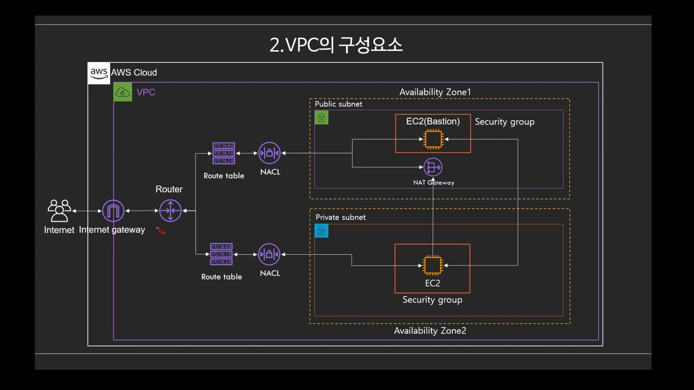

**AWS 사용 전 네트워크 기초 지식 정리** 
{: .notice--info}

참고 영상 : https://youtu.be/vCNexbgYmQ8

# AWS 사용 전 네트워크 기초 지식 정리

**VPC : Virtual Private Cloud**

## VPC 구성 - 라우팅 테이블

.jpg)

AWS에 어느 리전을 사용하더라도 기본적으로 미리 생성되어있는 Default VPC의 대역 :
→ **172.31.0.0/16**

리전마다 사용되는 가용영역의 각각 다르며 최소 2개. 서울리전은 4개(a,b,c,d 그 안에 각각의 서브넷 1개씩 가지고있음)

AWS 서비스는 크게 3가지.

- 글로벌 서비스 : AWS안에 있지만, 리전 안에 속해있지 않는 서비스 
  ex) IAM, CloudFrond, Route53, WAF 등
- 지역(리전)서비스 : 리전안에 속해있지만 가용영역을 따르지 않는 서비스
  ex) VPC, S3 등(S3의 경우 전 세계에서 동일하게 사용할 수 있으나 데이터 자체는 리전에 종속)
- 가용영역에 상주하는 서비스
  ex) EC2, RDS 등

리전? AWS의 서비스가 제공되는 서버의 물리적 위치 

리전 선택 고려사항

- 지연속도
- 법률(데이터, 서비스제공 관련)
- 사용 가능한 AWS 서비스

**가용영역(Available Zone)**

\- AWS 리전의 중복 전력, 네트워킹 및 연결이 제공되는 하나 이상의 개별 데이터 센터로 구성

\- 애플리케이션 하나를 여러 AZ에 걸쳐 분할하면 기업의 격리가 더 원활하게 이루어지며 정전, 낙뢰, 토네이도, 지진 등과 같은 문제로부터 안전하게 보호

\-  AZ는 다른 모든 AZ와 수 킬로미터에 상당하는 유의미한 거리를 두고 물리적으로 분리(서로 100km 이내 위치)

\- 예를 들면, 일반적으로 2개의 가용영역을 사용한다. 왜냐하면, 하나의 어플리케이션 서비스를 A라는 DataCenter에 AZ 를 구축 해놓는다면 천재지변으로 A DataCenter가 무너졌을 때 서비스가 중단될 우려가 있다. 따라서 A DataCenter와 B DataCenter의 가용영역에다 애플리케이션 서비스를 구축해 놓는다면 이중화 구성으로 더 높은 HA(고가용성)을 구축할 수 있다. 

유저1이 사용하고있는 가용영역(AZ) 'A'와 유저2가 사용하고있는 가용영역(AZ) 'A'가 서로 같다고 보장할 수 없음.

그 이유는 사용자들이 기본적으로 가용영역을 선택할때 A 부터 사용한다는 점에서 트래픽이 A에만 몰리는 것을 방지하기 위해, 중간에 하나의 단계를 더 두었음. 다른 유저가 누군가의 데이터를 침해하기위해 데이터 센터를 특정하는 것을 방지할 수 있다는 장점도 존재.

**엣지 로케이션이란?**

엣지 로케이션은 Amazon의 CDN 서비스인 CloudFront 를 위한 캐시 서버들의 모음(집합)을 의미한다.

 

**CDN(content Delivery Network)란?**

컨텐츠(html,image, 동영상, 파일 등)를 서버와 물리적으로 멀리 있을경우 전송속도가 느리다는 단점이 있다. 그래서 전세계 곳곳에 캐시 서버를 두어 사용자와 가까운 캐시서버에 컨텐츠를 저장하고 사용자들이 빠르게 컨텐츠를 사용할 수 있게 제공하는 서비스이다.

예를들면, 미국에 있는 사용자가 한국 드라마를 본다면 한국에서 드라마 컨텐츠를 다운 받을때 물리적인 거리가 멀기 때문에 전송속도가 한국사용자들에 비해 비교적 느릴 것이다. 따라서 미국에 캐시서버에 한국 드라마 컨텐츠 파일을 저장해 놓고 다운 받는다면 훨씬 더 빠르게 다운 받을 수 있다.

 

**ARN :**

Amazon Resource Name : AWS의 모든 리소스의 고유 아이디

**VPC의 구성요소**

