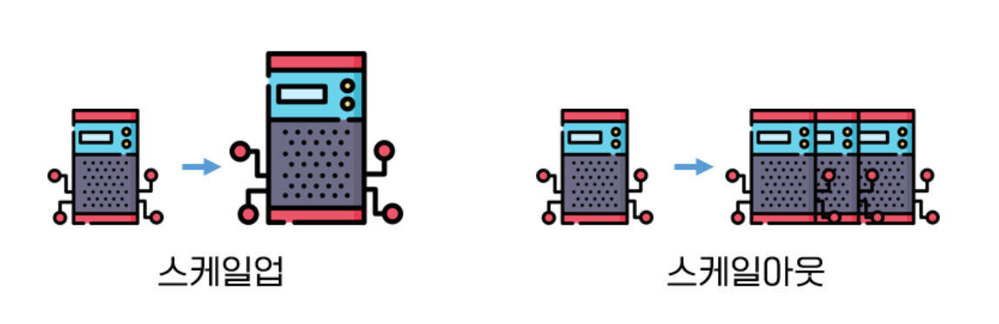

**AWS Auto Scaling 실습테스트** 
{: .notice--info}


# Auto Scaling

서버의 과부하나 장애 등 서비스가 불능상태가 되면 자동으로 서버를 복제/추가하여 서버를 늘려주는 작업. 이는 Cloud의 장점이라고 할 수 있다. 온프레미스의 경우 장비 유지보수비가 비싸며 서버증설을 위한 작업이 까다롭다.




**scale-up :**
트래픽을 보다 신속하게 처리하기 위해 고속의 프로세서를 장착하는 전략

**scale-out :**
같은 서버를 여러 대 복제하여 트래픽을 분산하는 전략


**Cool Down Time :** 오토 스케일링은 인스턴스를 시작하거나 종료한 후 단순 조정 정책에 의해 시작된 추가 조정 활동이 시작되기 전에 휴지 기간(Cool Down Time)이 끝날 때까지 기다립니다. 휴지 기간의 목적은 오토 스케일링이 이전 활동의 효과가 나타나기 전에 추가 인스턴스를 시작하거나 종료하는 것을 방지하는 것

쉽게 예를들면 Cool Down Time이 5초로 설정되어있는 경우, CPU가 기준치를 초과하여 오토스케일링이 조정활동(인스턴스 추가)을 이제 막 했는데  5초만에 인스턴스가 생성되어있을리가 없음에도 5초 의 Cool Down Time이 다 되어 "인스턴스가 더 필요한 상황"이라는 것만 감지 후 또 생성할 수 있다는 문제가 있다.


## 오토스케일링 실습

AMI를 사용하지 않고, 인스턴스 생성시 S3 특정 버킷에 있는 index.html을 EC2 안으로 불러오기하여 웹화면을 띄울 수 있는 과정.

### 1. Launch Template

강의에서는 시작구성(Launch Configuration)을 생성하였으나, 현재기준으로는 시작템플릿이 더 최신 & 권장되는 것으로 보여진다.

Launch Template은 EC2가 생성될 때 어떠한 설정으로 생성할지 명시해놓은 일종의 명세서

따라서 다음과 같은 설정정보를 포함한다.

- 인스턴스 타입

- 키페어 이름

- 보안그룹

- 스토리지

- ec2 생성시 퍼블릭IP 자동할당 여부

- user detail data (ec2생성되었을때 실행할 명령어)
  ```shell
  #!/bin/bash
  
  yum install httpd -y
  service httpd start
  chkconfig httpd on
  aws s3 cp s3://jin-as-test-1106/index.html /var/www/html --region ap-northeast-2
  ```


### 2. Application LoadBalancer

※ 로드밸런서를 생성하다 보면 결국 Target Group 생성 선행이 요구된다.

- Target Group 생성시 설정된 내용 : 
  - 대상 유형(인스턴스)
  - HTTP 프로토콜 80포트
  - 대상그룹에 포함할 인스턴스가 있는 VPC
  - 상태검사 (상태검사할 프로토콜(HTTP), 상태검사경로(/index.html))
- Load Balancer 생성시 설정된 내용 :
  - 매핑할 vpc 및 서브넷
  - 보안그룹
  - 리스너(예의주시할 프로토콜 및 포트), 대상그룹 선택


### 3. Auto Scaling

1. 원하는 용량, 최소용량, 최대용량
2. 사용할 시작템플릿
3. 분산 생성하는데 사용될 vpc, subnet
4. (선택사항) 사용할 로드밸런싱(학습 간에는 없음, 기존, 새로운 것중 위에서 생성한 ‘기존’로드밸런서를 사용하였음)
5. 상태확인 EC2(default), ELB → EC2는 기본적으로 서버가 있냐없냐정도만 확인하기 때문에 ELB를 해주어야 위의 대상그룹(타겟그룹)에서 설정했던 상태검사경로를 참조하여 보다 디테일한 상태검사를 실시한다.
6. 크기 조정정책(CPU 특정 수치 이상일 경우 증량한다는 정책을 설정할지 등)
7. 알림 추가
8. 여기서 태그지정을 통해 새로 생성되는 EC2에 태그를 부여할 수 있음