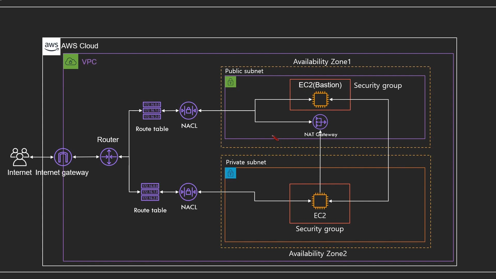

**AWS VPC, Bastion Host, NAT Gateway** 
{: .notice--info}


## VPC 구성도

(※ 기초적인 구성도)



내부에서만 서비스하면 되는 데이터베이스 같은 것들은 통상적으로 Private subnet에 위치시킨다.  
다만, 인터넷이 연결되어있지 않기 때문에 Bastion Host, NAT Gateway를 사용.

프라이빗 ec2도 결국 아래와 같은 이유로 인터넷 연결이 필요

- 데이터베이스 업데이트
- 데이터 조작
- 패치 진행 등


.jpg)

Bastion Host, NAT Gateway는 일종의 '프라이빗 서브넷 내에 있는 EC2가 외부와 통신하기위해 사용되는 대변인' 같은 역할

NAT Instance는 EC2와 같은 서버라서 꺼지면 죽어버리고, 서버 타입(크기)에 따라 최대 트래픽 처리량이 결정되는데,

NAT Gateway는 서비스이기 때문에 서비스가 중단될 일이 없으며, 고가용성(5G~45G/s 범위의 유연함)


### 실습 1 - 보편적인 VPC 환경 구성

1. VPC 생성 (10.0.0.0/16)  
    **라우팅테이블**, **Network ACL**, **SG** 이 3가지가 기본적으로 같이 생성됨

2. 서브넷 생성 2EA  
   두개의 가용영역에 **퍼블릭 서브넷, 프라이빗 서브넷** 생성

3. 인터넷 게이트웨이 생성  
   VPC에 붙여주기(인터넷 게이트웨이는 VPC하나에만 연결할 수 있음)

4. 라우팅테이블 작업
   1. Default 라우팅 테이블 :  
      VPC를 생성할 때 기본적으로 생성된 Default 라우팅 테이블을 클릭해보면  
      '라우팅' 속성에 10.0.0.0/16 범위를 가지고있음.(이 범위 내 IP를 향한 request인 경우 local로 인식한다는 의미)   
      이 라우팅테이블을 프라이빗 라우팅테이블로 지정(이름에 Private이 들어가도록 지정)  
      위에서 생성한 **프라이빗 서브넷** 연결(서브넷 연결 탭에서(사실 굳이 연결해주지 않아도 나중에 생성하게될 퍼블릭 라우팅과 퍼블릭 서브넷을 연결하고나면, 어디에도 연결되지 않은 남는 서브넷이 '기본 서브넷(Default Subnet)'에 연결됨))  
   2. 퍼블릭 라우팅테이블 생성 (10.0.0.0/16)  
      위에서 생성한 **퍼블릭 서브넷** 연결(서브넷 연결 탭에서)  
      위에서 생성한 **인터넷 게이트웨이** 연결(라우팅 탭 → [편집] → 0.0.0.0/0 igw 연결)
   
5. NACL (Network Access Control List) 생성  
    VPC를 생성하면 기본적으로 하나 생성된다.(기본값 : "예"로 되어있음) 그러나 Public, Private 구분을 위해 하나를 더 생성해준다.(자동으로 기본값 : "아니오"로 설정됨)  
    인바운드, 아웃바운드 규칙을 보면 기본적으로 0.0.0.0/0에 대해 DENY로 설정되어있음  
    새로 생성한 '퍼블릭 NACL'에 대하여 아래와 같이 설정 (프라이빗 NACL은 냅둠)
    
    1. 인바운드 규칙 (수정) 추가 :
        1. 80 port | 0.0.0.0/0 | allow
        2. 443 port | 0.0.0.0/0 | allow
        3. 22 port | 0.0.0.0/0 | allow
        4. 모든 port | 0.0.0.0/0 | deny
    2. 아웃바운드 규칙 (수정) 추가 :
        1. 1024 - 65535 port | 0.0.0.0/0 | allow
        2. 모든 port | 0.0.0.0/0 | deny
    
6. ec2 생성  

    1. 퍼블릭 서브넷 쪽에 생성  

    2. '퍼블릭 IP 자동 할당' 항목에는 '서브넷 사용 설정(비활성화)'가 있다. '활성화'라는 항목을 선택할 수도 있지만 서브넷에 설정된 설정값을 자동으로 따르겠다는 위 항목을 활용하고자 한다면 앞서 생성했던 "서브넷" 목록화면에서 생성한 서브넷 선택 > [작업] > 자동할당IP설정수정 > 활성화 체크 한 후 다시 ec2 생성화면 내에서 퍼플릭 서브넷을 선택하면 '서브넷 사용 설정(활성화)'로 바뀌어있는 것을 확인할 수 있다.

    3. 사용자 데이터에 다음 코드 입력
        ```shell
        #!/bin/bash
        yum install httpd -y
        service httpd start
        ```

    4. 보안그룹 구성시 80포트 0.0.0.0/0, ::/0 오픈

    5. 여기까지해서 생성된 EC2는 퍼블릭 IP가 할당되어있고 해당 IP를 브라우저 URL에 입력하면 아파치 기본 화면을 볼 수 있음

    6. 위와 동일하게 프라이빗 EC2 생성 (프라이빗 서브넷 쪽에 생성)

    7. 연결할 서브넷으로 프라이빗 서브넷을 선택하면 당연하게도 '서브넷 사용 설정(비활성화)'을 확인할 수 있다


### 실습 2 - Bastion Host, NAT Gateway 생성

1. 퍼블릭 서브넷 연결한 EC2 생성
   1. **public 전용 SG 생성**
      1. 보안그룹 22포트(SSH) 모든 IP(0.0.0.0/0) 대상
      2. 보안그룹 0 - 665535포트범위 | 모든 ICMP 프로토콜 모든IP(0.0.0.0/0) 대상
2. 프라이빗 서브넷 연결한 EC2 생성
   1. **private 전용 SG 생성**
      1. 보안그룹 22포트 (SSH 프로토콜)& 위에서 생성한 **퍼블릭 SG 대상**(이 EC2에는 퍼블릭SG에서 오는것만 받겠다는 설정)
      2. 보안그룹 ICMP 프로토콜에 대하여 0 - 665535포트범위 오픈 & 마찬가지로 위에서 생성한 **퍼블릭 SG 대상**
3. VPC - NAT Gateway 생성
   1. 위치는 퍼블릭 서브넷 쪽에 위치 필수
   2. 새 EIP 생성 및 할당
4. NAT Gateway ←→ 프라이빗 라우트 테이블 연결
   1. VPC 네비게이션 바 > 라우팅테이블 > 프라이빗 라우트테이블 > 하단 라우팅 탭 > [편집] > 대상 : 0.0.0.0/0 | 대상 : NAT Gateway(위에서 생성한 NAT Gateway 선택)