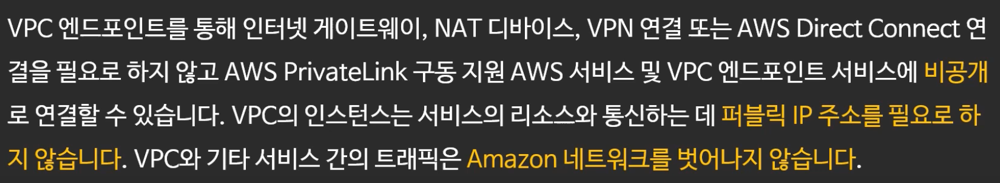
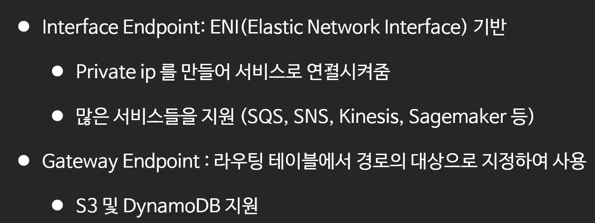

**AWS VPC Endpoint** 
{: .notice--info}

# VPC Endpoint

.jpg)

### Interface Endpoints를 사용하는 경우

프라이빗 서브넷 안에 위치

.jpg)

### Gateway Endpoints를 사용하는 경우

프라이빗 EC2에서 S3로 접근하려고 할때 :  
EC2 → NACL → Route table → Router → Gateway Endpoints → S3

.jpg)

AWS의 서비스마다 Interface 유형인지, Gateway 유형인지는 정해져있다.
"S3, DynamoDB만 Gateway. 나머지는 다 Interface에요"

### 실습

1. IAM생성 (역할(role) 생성)  
   EC2가 S3에 접근할 수 있도록 기본적으로 role 필요
   1. **누가 사용하게 된 것인지 선택하는 첫 화면**에서 **"EC2"** 선택
   2. 빠른 실습을 위해 S3 Full Access 관련 권한 부여
2. 프라이빗 EC2 생성
   1. 프라이빗 서브넷 영역에.
   2. "IAM 역할" 설정란 위에서 생성한 S3권한 관련 role 선택
   3. 보안 구성은 앞서 실습때 생성했던 private SG 선택
3. 퍼블릭 EC2 생성
   1. 퍼블릭 서브넷 영역에.
   2. 이 EC2는 S3랑 통신할 용도가 아니기 때문에 IAM 줄필요 없음
   3. 보안 구성은 앞서 실습때 생성했던 public SG 선택
4. 버킷 생성
5. 생성한 퍼블릭EC2(bastion host) 접속
   1. 터미널에서 `ssh {위에서 생성한 프라이빗EC2 사설IP}` 입력(접속완료)
   2. `aws s3 ls --region ap-northeast-2` 입력 결과 반응 없음

6. VPC > (사이드 바)Endpoint 이동 및 생성
   1. 대상서비스 S3 선택
   2. 프라이빗 서브넷 선택
   3. 여기까지하면 프라이빗 라우팅테이블의 라우링 탭을 보면 한가지가 추가되어있음
      "프라이빗서브넷 영역 안에서 발생된 S3에 대한 요청건은 가로채서 위에서 생성한 엔드포인트로 보낸다"라는 의미.  
      별도로 설정한 것이 없음에도 이 private 라우트테이블에 표시되는 이유는 위 단계에서 프라이빗 서브넷을 연결했다는 점과 기본적으로 프라이빗 서브넷과 연결되어있는 프라이빗 라우트 테이블이라는 점이 더해졌기 때문.
   4. 여기까지의 과정을 통해 5-b단계의 명령어를 통해 프라이빗 ec2에서 s3 조회(접근)가 가능해졌다.

