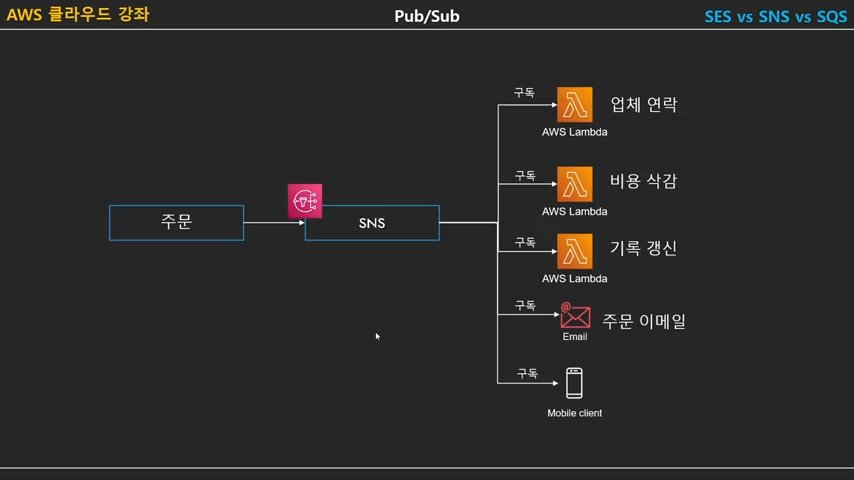

**SES vs SQS vs SNS 의 차이점에 대하여** 
{: .notice--info}

# SES

Amazon Simple Email Service : 개발자가 모든 애플리케이션 안에서 이메일을 보낼 수 있는 경제적이고, 유연하며, 확장 가능한 이메일 서비스입니다. SES를 빠르게 구성하여 트랜잭션, 마케팅 또는 대량 이메일 커뮤니케이션을 포함한 다수의 이메일 사용 사례를 지원할 수 있습니다.

- 이메일을 보내거나 받을 수 있는 서비스
- 이메일을 받을 때 여러 방법으로 처리 가능
  - Lambda 호출
  - SNS 호출
  - S3에 이메일 저장
- 대량의 이메일을 보내기 위해서는 샌드박스 모드 해제 필요 (AWS Support 센터)

# SNS

Amazon Simple Notification Service : 애플리케이션 간 및 애플리케이션과 사용자간 통신모두를 위한 완전관리형 메시징 서비스

- Pub(퍼블리싱,발행)/Sub(구독) 기반의 메세징 서비스
  - **하나의 토픽을 여러 주체가 구독**
    - 토픽에 전달되 내용을 구독한 모든 주체가 전달받아 처리

- 다양한 프로토콜로 메시지 전달 가능
  - 이메일
  - HTTP(S)
  - SQS
  - SMS
  - Lambda
- **하나의 메시지를 여러 서비스에서 처리**

.jpg)

주문이 들어오면 주문 정보가 SNS 서비스에 넘어가면서 일종의 트리거처럼 이 SNS를 구독하는 다른 서비스들을 실행 

SNS에서 빼놓을 수 없는 개념 = Fan Out Architecture

.jpg)

동영상 업로드 > S3 저장 > Lambda 트리거 > SNS

이 때, EC2들이 각각 다른 역할로 분담하여 기능하는 구조

# SQS

Amazon Simple Queue Service : 마이크로 서비스, 분산 시스템 및 서버리스 애플리케이션을 쉽게 분리하고 확장할 수 있도록 지원하는 완전관리형 메시지 대기열 서비스.

- AWS에서 제공하는 큐 서비스
  - 다른 서비스에서 사용할 수 있도록 메시지를 잠시 저장하는 용도
  - 최대 사이즈 : 256kb, 최대 14일까지 저장 가능
- 주로 AWS 서비스들의 느슨한 연결을 수립하려 사용
- **하나의 메시지를 한번만 처리**
- AWS에서 제일 오래된 서비스

.jpg)

람다와 EC2가 위와 같이 타이트하게 결합되어있는 상태에서, Lambda에서 EC2로 데이터를 넘길 때,  EC2가 다운되었다면 그 데이터는 증발.

이를 방지하고자할 때 아래 이미지와 같이 중간에 SQS라는 큐 서비스를 사용할 수 있다.

.jpg)

# SNS vs SQS

.jpg)