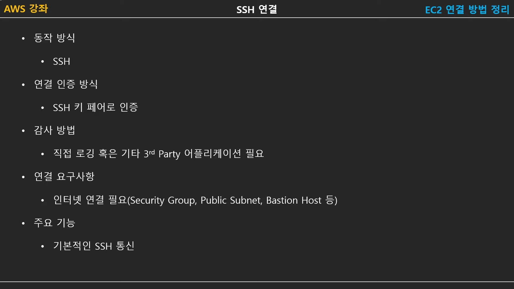

**EC2 연결방법 4가지에 대하여.** (SSH, EC2인스턴스연결, SSM, 직렬콘솔)
{: .notice--info}

# EC2 연결방법 4가지

##   SSH연결

(SSH 키 페어를 통한 방법)

## EC2 인스턴스 연결

.jpg)

그냥 브라우저에서 '연결' (다만, 권한이 있는 계정만 가능)

## SSM 연결

.jpg)

관련 role :

- 사용 대상 : EC2
- 사용될 정책 : AmazonEC2RoleforSSM

이 Role이 EC2에 설정되어야한다.

- SSM을 사용할 ec2 지정 > 우측 상단 [작업] > 보안 > IAM 수정 > 위에서 생성한 Role 선택 및 저장 > SSM 사용준비 완료

이렇게되면 SSM 콘솔에서도 해당EC2를 확인할 수 있게됨

## 직렬콘솔

.jpg)

## 비교표

.jpg)
