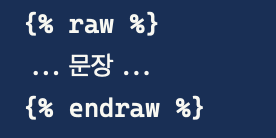

# # Django

## Django 기초 정리

virew.py파일 예제

```python
from rest_framework.views import APIView

class Main(APIView):
  def get(self, request):
    feed_list = Feed.objects.all()
    return render(request, 'instagram/main.html', context=dict(feeds=feed_list))
```

- rest_freamwork.views로 부터 import한 APIView를 Main 클래스의 파라미터로 사용

- 템플릿 HTML에 값을 전달하고자 할 때 `context`

- HTML에서는 feeds라는 dict 사용 가능

```html
/* 예시 */

	<p>{{feed.content}}</p>
	<p>{{feed.user_id}}</p>
	<p>{{feed.like_count}}</p>
	</img>

```


> ! git blog - jekky theme에서 Django 템플릿 문법을 사용하는경우 Ruby기반의 템플릿 언어 'Liquid'와 문법이 같기 때문에 escape(```) 처리로 인식된다.
>
> 이를 방지하기 위해서는 문장의 앞뒤를 다음과 같이 처리해야한다.
>
> 

## Django 템플릿 문법

변수 기본 출력 방법 : **{\{변수명\}}**

뷰에서 탬플릿으로 context전달이 가능

### 템플릿 필터

- 필터는 파이프(\|)를 통해 사용가능
- 약 60여 가지 필터 제공
- 필터는 커스텀 가능<https://django-doc-test-kor.readthedocs.io/en/old_master/howto/custom-template-tags.html>
- [필터에 대한 내용은 공식문서 참고](https://django-doc-test-kor.readthedocs.io/en/old_master/ref/templates/builtins.html#ref-templates-builtins-filters)

**\{\{ name\|lower\}\}**  
name 변수값의 문자를 소문자로 변경

**\{\{ text|escape|linebreaks \}\}**   
(필터 체인 가능) text 변수값 중 특수문자를 이스케이프하고, 
그 결과 스트링에 <p>태그 적용

**\{\{ bio|truncatewords:30 \}\}**  
(인자있는 필터) bio 변수값 중 앞에서 30개 단어만 보여주고, 줄바꿈 문자는 모두 없애줌

**\{\{ list\|join:"+" \}\}**   
list 변수값에 join 적용, 필터 인자의 빈칸은 따옴표로 묶어줌  
list가 ['a', 'b', 'c']인 경우, "a+b+c"

**\{\{ value\|default:"nothing" \}\}**  
value 변수값이 False이거나 없는 경우, "nothing"으로 보여줌

**\{\{ value\|length \}\}**  
value 변수값의 길이 반환(스트링이거나 리스트인 경우도 가능)

**\{\{ value\|striptags \}\}**  
 value 변수값에서 HTML tag 없애줌 

**\{\{ value\|pluralize \}\}**  
복수 접미사 필터, value 변수값이 1이 아니면 복수 접미사 s 붙임

다른 복수 접미사 es, ies는 필터에 인자를 사용함
**\{\{ value\|pluralize:"es" \}\}** 또는 **\{\{ value\|pluralize:"ies" \}\}**

**\{\{ value\|add:2 \}\}**  
더하기 필터, value 변수값이 4이면, 결과는 6
\* 정수가 아닌 경우, 더하기를 시도하고, 실패하면 빈 문자열 반환


### 템플릿 태그 - 

```html
 
    <div>번호 : {{forloop.counter}} 번째 data</div>
    <div>제목 : {{i.title}}</div>
    <div>추천수 : {{i.likeCount}}</div>
    <div>조회수 : {{i.viewCount}}</div>
    <div>내용 : {{i.contents}}</div>

```

#### 반복문 카운트

- \{\{forloop.counter\}\}는 반복문안에서 사용하면 반복 횟수만큼 count(1부터 시작)
- \{\{forloop.counter0\}\} : 0부터 반복횟수만큼 count
- \{\{forloop.revcounter\}\} : 전체 길이로 시작해서 1까지 count
- \{\{forloop.revcounter0\}\} : 전체 길이로 시작해서 0까지 count
