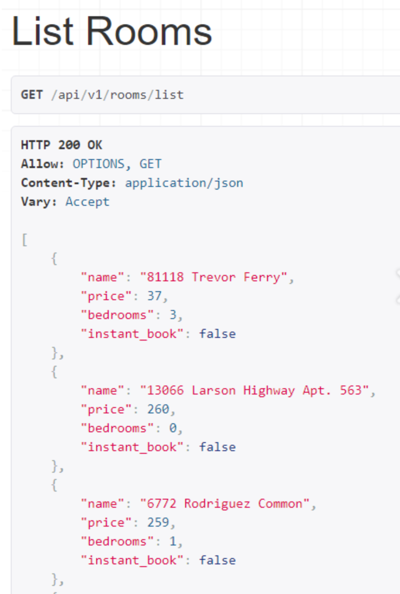
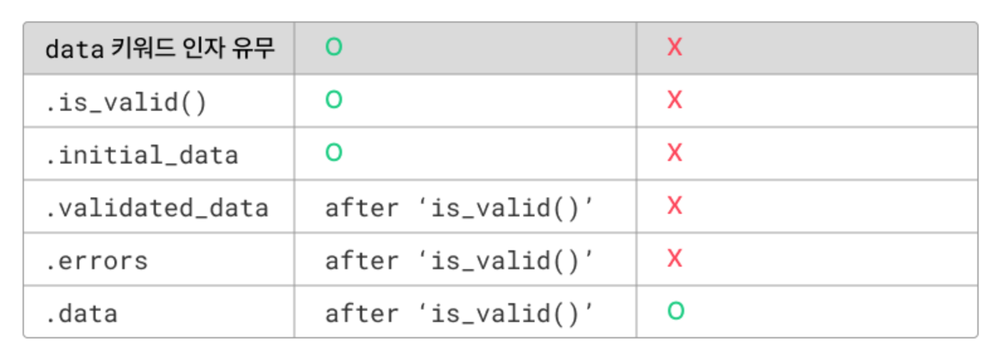

**Django Rest Framework - Serializers에 대하여.**
{: .notice--info}


# Rest Framework 

새로운 디바이스와 어플리케이션들이 생겨나면서 웹으로만 서비스를 제공하는데 한계가 생겼다. 기존의 웹서버를 계속 사용하면 매번 HTML을 읽어서 해당 태그에 있는 정보를 찾아내는 일은 매우 힘들고 비율적이었고, 더 이상 HTML로 렌더링 하는 웹서버가 아닌 JSON 혹은 XML과 같은 형식을 통해 데이터를 다루는 별도의 API 서버가 필요해졌고, 그렇게 HTTP Method와 함께 웹, 데스크탑앱, 스마트폰 어플들까지 하나의  API 서버를 사용할 수 있는 RESTful한 서버가 생겨났다. 

## DRF

**DRF : Django Rest Framework로써 Django 안에서 RESTful한 API 서버를 쉽게 만들수 있도록 도와주는 라이브러리**.

모델을 통해 조회된 값을 앞서 QuerySet이라고 배웠다. 이를 클라이언트에게 전달하기 위해 JSON타입으로 변환이 필요한데 일반적으로 Python에서 하듯 json 모듈을 써서 dump 메서드로 json을 만드는 방법은 통하지 않는다. 아래 코드를 실행한다면 TypeError : Object of type Room is not JSON serializable 라는 에러가 발생한다.

```python
rooms = Room.objects.all()

rooms_json = []
for room in rooms:
    rooms_json.append(json.dumps(room))
response = HttpResponse(content=rooms_json)
```

이렇듯, DB결과값인 쿼리셋을 json으로 변환과 동시에 validation check까지 지원하는 것이 DRF의 **Serializers**이다.

> serializer(직렬화) : DB결과값 쿼리셋을 클라이언트로 보내기 전 json으로 변환할 때 사용
>
> deserializer(역직렬화) : 클라이언트로부터 전달받은 json 값을 DB 저장하기 위한 데이터 변환 과정

### Serializer

```python
# rooms/seiralizers.py
from rest_framework import serializers

class RoomSerializer(serializers.Serializer):
    name = serializers.CharField(max_length=140)
    price = serializers.IntegerField()
    bedrooms = serializers.IntegerField()
    instant_book = serializers.BooleanField()
```

DB 조회 결과값(쿼리셋)에서 json으로 변환하고 싶은 필드만 model에서 빼와 위와같이 작성하면 되며, 앞서말한 validation도 이 serializer를 통해 해결할 수 있다.

이렇게 선언한 serializer 하나로 직렬화와 역직렬화가 가능하다. 

### ModelSerializer

여기서 한 단계 더 나아가, 위와 같이 모델에서 필요한 필드를 일일히 따와 긴 코드로 작성할 필요 없이, 다음과 같이 ModelSerializer를 상속 받은 후 Meta 클래스를 통해 작성할 수도 있다.

```python
# rooms/seiralizers.py
from rest_framework import serializers
from . import models as rooms_models

class RoomSerializer(serializers.ModelSerializer):
    class Meta:
        model = rooms_models.Room
        fields = (
            "name",
            "price",
            "bedrooms",
            "instant_book",
        )
```

ModelSerializer 사용시 위와 같이 필드명을 직접 명시하는 방법 외에 해당 모델의 모든 필드를 시리얼라이징하고자 할 때 다음과 같이 선언하면된다. `fields = '__all__'`

위에서 작성한 Serializer는 view.py에서 다음과 같이 사용할 수 있다.

```python
#rooms/views.py
from rest_framework.decorators import api_view
from rest_framework.response import Response
from . import models as rooms_models
from .serializers import RoomSerializer

# GET 방식만 받도록 함
@api_view(["GET"])
def list_rooms(request):

    rooms = rooms_models.Room.objects.all()
    
    # many=True ← rooms가 여러 값으로 이루어진 것이라는 것을 Serializer에게 알려주는 것
    serialized_rooms = RoomSerializer(rooms, many=True)

    # HttpResponse가 아니라 DRF의 Response를 씁시다.
    return Response(data=serialized_rooms.data)
```


위 API 호출결과 ▼




쿼리셋은 기본적으로 모델에서 정의된 필드들로 제한되어있지만, ModelSerializer에서 SerializerMethodField를 통해 임의의 필드를 덧붙일 수도 있다.

```python
class UserSerializer(serializers.ModelSerializer):
    event_age = serializers.SerializerMethodField(help_text="Custom Field")

    def get_event_age(self, instance):
        return True if instance.age < 30 else False
```

이렇게하면, 쿼리셋A의 값이 `{'name' : '철수', 'age' : 15}` 라고 가정할 때, 
`result = UserSerializer(쿼리셋A)`을 하게되면 result에는 다음과 같은 값이 담긴다

`{'name' : '철수', 'age' : 15, 'event_age' : True}`


### Create & Update

Serializer 선언부에 create(), update() 메서드를 구현하여 DB에 **insert** 혹은 **update**를 할 수도 있다.

```python
# rooms/seiralizers.py
from rest_framework import serializers

class RoomSerializer(serializers.Serializer):
    name = serializers.CharField(max_length=140)
    price = serializers.IntegerField()
    bedrooms = serializers.IntegerField()
    instant_book = serializers.BooleanField()

    def create(self, validated_data):
        return Room.objects.create(**validated_data)

    def update(self, instance, validated_data):
        instance.name = validated_data.get('title', instance.title)
        instance.price = validated_data.get('price', instance.price)
        instance.bedrooms = validated_data.get('bedrooms', instance.bedrooms)
        instance.instant_book = validated_data.get('instant_book', instance.instant_book)
        instance.save()
        return instance
```

이렇게 선언한 두 메서드를 view에서 사용하는 방법은 다음과 같다.

- 생성(create) > 인자 1개
  ```python
  # (view에서)
  serializer = RoomSerializer(data=data)
  
  # 최종 commit
  serializer.save()
  ```

  인자가 하나밖에 없기 때문에 RoomSerializer 클래스의 create로직이 사용된다.

  create 메서드에 의해 DB에 생성이 된다.

- 수정(update) > 인자 2개
  ```python
  # (view에서)
  serializer = RoomSerializer(room, data=data)
  ```

  첫번째 인자 : 바꾸고자하는 기준 데이터

  두번째 인자 : 적용할 new 데이터

> ModelSerializer의 경우 create()와 update()도 기본적으로 포함되어 있기 때문에 정의할 필요 없다. (추가 기능을 넣으려면 오버 라이딩해서 사용하면 된다)

이렇게 request body로부터 데이터를 받아 DB에 적용할 수 있도록 변환해주는 Deserializer 단계에서는 save() 이전에 **is_valid()**를 반드시 호출하여 검사해야한다. 직렬화와 역직렬화 예제를 다시한번 다음과 같이 확인해보자

```python
# serializer (직렬화)
def index(request):
    if request.method == 'GET':
        user = request.user
        serializer = UserSerializer(user).data
    return Response(serializer)
```

```python
# deserializer (역직렬화)
def index(request):
    if request.method == 'POST':
        serializer = UserSerializer(data=request.data)
    if serializer.is_valid()  # bool으로 True/False가 리턴됨
        data = serializer.save()
        serializer = UserSerializer(data).data
    return Response(serializer)
# 참고
# serializer.is_valid() 이후 확인 해볼 수 있는 작업
# serializer.validated_data -> 역직렬화된 값들을 직접 확인해 볼 수 있다.
# serializer.errors -> is_valid()에서 실패했을때 이유를 알 수 있는 구문이다.
```

> view에서 serializer()를 사용할 때 UserSerializer(**data**=인자) 이런식으로 data 키워드 사용 여부에 따라 다음과 같은 제한이 있다
>
> 

### nested objects(중첩 객체)

 serializer 클래스를 만들다 보면 중첩된 serializer를 만드는 경우가 있다. 그 예는 아래와 같다.

```python
class UserSerializer(serializers.Serializer):
    email = serializers.EmailField()
    username = serializers.CharField(max_length=100)
    
class CommentSerializer(serializers.Serializer):
    user = UserSerializer(required=False)  # May be an anonymous user.
    edits = EditItemSerializer(many=True)  # A nested list of 'edit' items.
    content = serializers.CharField(max_length=200)
    created = serializers.DateTimeField()
```

위의 예를 보면 CommentSerializer 내부에 UserSerializer가 포함된 user 변수를 만드는 경우를 볼 수 있다. required=False라는 설정은 로그인하지 않은 사용자가 comment를 사용 가능하도록 만든 것이라고 이해할 수 있다.


### many=True

```python
queryset = Book.objects.all()
serializer = BookSerializer(queryset, many=True)
serializer.data
# [
#     {'id': 0, 'title': 'The electric kool-aid acid test', 'author': 'Tom Wolfe'},
#     {'id': 1, 'title': 'If this is a man', 'author': 'Primo Levi'},
#     {'id': 2, 'title': 'The wind-up bird chronicle', 'author': 'Haruki Murakami'}
```


### Serializer를 사용한 MVT 한 싸이클 예제

- **serializer.py**

```python
# api/serializer.py
from rest_framework import serializers
from .models import Item_Info


class ItemSerializer(serializers.ModelSerializer):
    class Meta:
        model = Item_Info
        fields = ('id', 'category_L', 'name', 'value', 'price')


class PriceSerializer(serializers.ModelSerializer):
    class Meta:
        model = Item_Info
        fields = ('id', 'price')


class ValueSerializer(serializers.ModelSerializer):
    class Meta:
        model = Item_Info
        fields = ('id', 'value')
```

- view.py

```python
# api/views.py
from django.shortcuts import render

from rest_framework.generics import UpdateAPIView, DestroyAPIView
from rest_framework.response import Response
from rest_framework.decorators import api_view
from .models import Item_Info
from .serializers import ItemSerializer, PriceSerializer, ValueSerializer
# Create your views here.

@api_view(['GET'])
def API(request):
    return Response("안녕하세요 api에 오신것을 환영합니다.")

@api_view(['GET'])
def ItemAPI(request, id):
    this_item = Item_Info.objects.get(id=id)
    serializer = ItemSerializer(this_item)
    return Response(serializer.data)
# => pid=id01에 대해 리턴된 Response: {'pid': id01, 'category_L': 0, 'name': 'can_pepsi', 'value': 5, 'price': 1500}


# api/views.py
@api_view(['GET'])
def PriceAPI(request, id):
    this_item = Item_Info.objects.get(id=id)
    serializer = PriceSerializer(this_item)
    return Response(serializer.data)
# => pid=id01에 대해 리턴된 Response: {'pid': id01,  'price': 1500}

# update
class UpdateAPI(UpdateAPIView):
    queryset = Item_Info.objects.all()

    serializer_class = ValueSerializer


# delete
class DeleteAPI(DestroyAPIView):
    queryset = Item_Info.objects.all()

    serializer_class = ItemSerializer
```

- **urls.py**

```python
# api/urls.py
from django.urls import path, include
from .views import API
from .views import ItemAPI, PriceAPI, UpdateAPI, DeleteAPI

urlpatterns = [
    path("api/", API),
    path("info/<str:id>", ItemAPI, name="get_info"),
    path("price/<str:id>", PriceAPI, name="get_price"),
    path("price/<str:id>/update", UpdateAPI.as_view(), name="update_item"),
    path("price/<str:id>/delete", DeleteAPI.as_view(), name="delete_item"),
]
```

