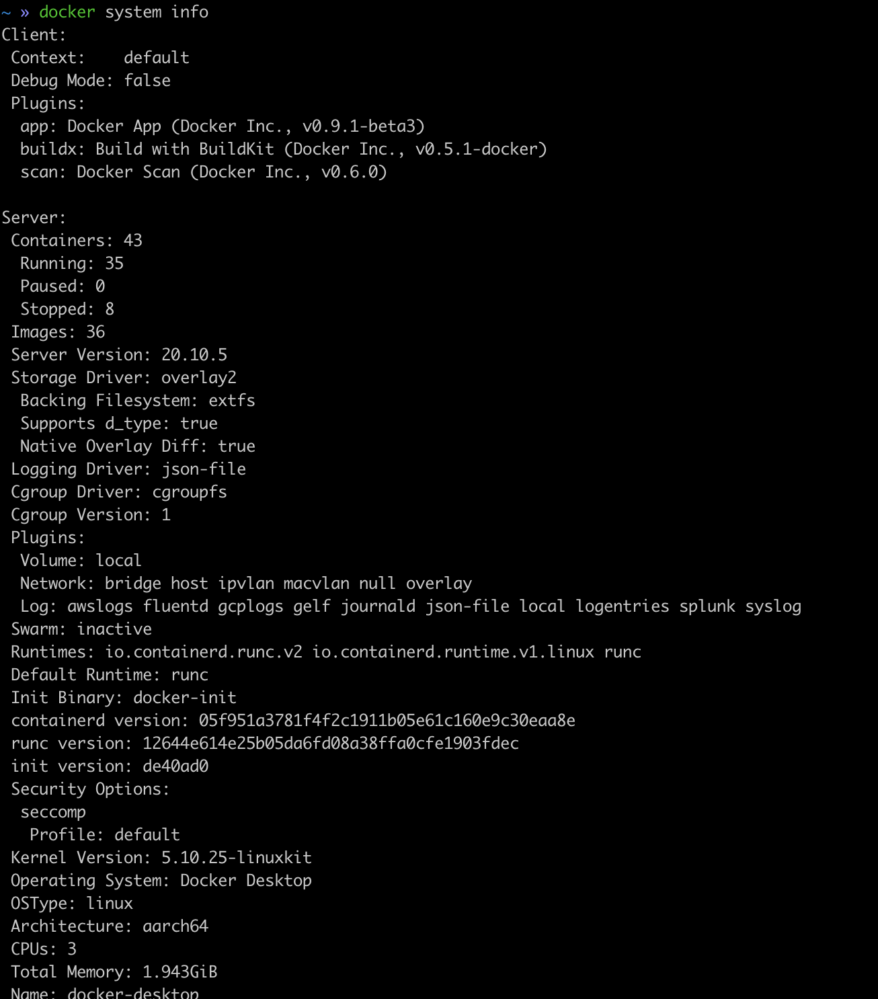
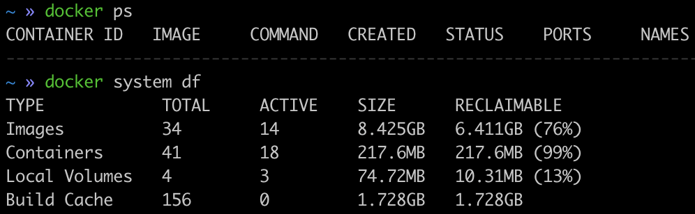
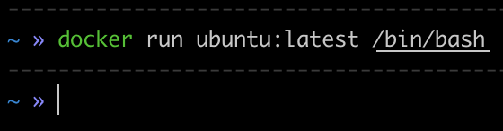
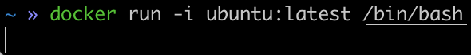

**docker**에 대하여
<br> → 첫번째 정리
{: .notice--info}


> os 시작 자동화 툴 : kickStart, Vagrant
>
> os 미들웨어 설정 자동화 툴 : Cheif, Ansible, Puppet, Itamae
>
> 여러 서버 관리 자동화 툴 : kubernetes


# Docker

### docker 실행환경 확인

`docker system info`

- 실행화면
  


### docker 디스크 이용 상황

`docker system df`

- 실행화면
  


### Image 검색

`docker search [옵션] <검색키워드>`

주요옵션

- `--no-trunc` : 결과를 모두표시
- `--limit` : n건의 검색 결과를 표시
- `--filter=stars=n` : n이상의 즐겨찾기수 이상인것만 필터링

예) 즐겨찾기 건수가 100건 이상인 이미지만 검색하기 → `docker search —filter=starts=100 nginx`


### docker를 이용한 웹서버 구축

```shell
docker pull nginx
docker container run --name webserver -d -p 80:80 nginx
```

'webserver'라는 임의의 이름으로 docker container를 가동시키는 명령.

만약 `docker container run --name webserver -d -p 1234:80 nginx` 로 하게 되면

http://localhost:1234 로 접속했을때 nginx웹서버 작동.

즉, (호스트포트) : {컨테이너 포트}

(브라우저에서 request된 포트=호스트가 넘겨받은 포트) : (도커 컨테이너 포트)


### docker 컨테이너 중지, 재시작, 삭제

```shell
docker stop webserver # 중지
docker start webserver # 시작

docker stop webserver 
docker rm webserver # 삭제하려면 중지가 선행되어야함
```


### Docker 이미지 목록 표시

`docker image ls`


> 이미지의 위장이나 변조를 막는 방법 :  **DCT  (Docker Content Trust)**


### 이미지 상세 정보 확인

`docker image inspect {이미지이름}`


### 이미지에 태그 설정

`docker image tag nginx jinjiny/webserver:1.0`

nginx라는 이미지에 jinjiny이라는 사용자, webserver라는 컨테이너명, 1.0이라는 버전정보를 나타내는 태그를 지정. 이때 사용자명은 임의로 지정할수 있지만, 문제는 만약 현재 로그인한 계정 username(ID)와 다르면 나중에 push할때 일치하지 않는다는 에러를 만나게된다.


### 이미지 삭제

`docker image rm <이미지명>`

주요옵션

- `--force`, `-f` : 이미지 강제 삭제
- `--no-prune` : 중간이미지를 삭제하지 않음

이미지 명은 REPOSITORY 또는 IMAGE ID로 지정할 수 있고,

IMAGE ID는 이미지를 고유하게 지정할 수만 있다면 되므로 모든 자리를 지정하지 않아도 처음 3자리 정도만으로도 가능

여러 개의 이미지는 스페이스로 구분하여 다중 삭제 가능


### Docker Hub에 로그인 → 이미지 업로드

```shell
docker login [옵션] [서버]

docker image push [이미지명]:[태그명]
```

로그인 옵션을 지정하지 않으면 사용자명과 비밀번호를 물어봄

로그인 옵션

- `--password`, `-p` : 비밀번호
- `--username`, `-u` : 사용자명

서버명을 지정하지 않았을 때는 Docker Hub에 액세스됨. 다른환경에 Docker 리포지토리가 있는 경우 서버명을 지정한다.

> 도커 허브에 업로드할 이미지는 다음과 같은 형식으로 지정  
> `{Docker hub 사용자명}/{이미지명}:{태그명}`

> Docker 현재 로그인 상태 확인 : docker login 했을 때 안되어있으면 unsername과 password를 요구. 로그인 되어있으면 아래와 같이 출력됨.  
> **Authenticating with existing credentials...**  
> **Login Succeeded**

> 로그인한 unsername이 "testname" 일때 할 때, 이미지의 repository도 testname/{이미지명} 형식으로 되어야한다. 그렇지않고 이미지의 username과 docker hub에 가입된 ID가 일치하지 않을 경우 업로드시 "denied: requested access to the resource is denied" 에러가 발생할 수 있다.

<br>

### Docker Container Life Cycle


### 컨테이너 생성과 실행을 동시에 하는 run

`docker container run -it —name "test2" centos /bin/bash`

> **-it 에 대하여.**
>
> - -i는 **표준 입력**을 열겠다는 설정.
>
> - -t는 **단말기 디바이스를 사용(확보)**하겠다는 설정
>
> - 쉽게 이해하면 i를 통해 명령 쉘에게 "인터렉티브 하게 하자" 라고 선언 하여 /bin/bash를 연다고 보면 된다.  
>   그래서 -i를 하지 않은 채 /bin/bash를 하면 우리의 쉘은 컨테이너와의 커뮤니케이션 모드가 되지 않아서 단발성으로 실행하고 끝나버린것처럼 보이게 된다.
>   
>
>   만약, -i만 하고 -t를 하지않으면 명령쉘은 커뮤니케이션 모드가 되어있지만 컨테이너에게는 별다른 후속처리(디바이스 사용 = 장비 사용 = 'centos' OS 컴퓨터 사용)를 하지 않은 상태이기 때문에 우리가 보는 터미널에서는 응답값을 끝도없이 기다리는 상태처럼 보이게된다. (exit로 빠져나와야 끝이난다)
>
>   
>
>   
>
>   `-i` → "쉘! 커뮤니케이션 모드 시작!" `-t` → "컨테이너! 너도 준비해!"


### run 관련 주요 옵션

- run 관련 주요 옵션
- -d, —detach : 백그라운드 실행
- -i —interacive : 컨테이너의 표준입력을 연다
- -t, —tty : 단말기 디바이스를 사용한다
- -u, —user : 사용자명을 지정
- —restart=[ no | on-failure | on-failure:횟수n | always | unless-stopped ] : 명령의 실행 결과에 따라 재시작을 하는 옵션
  - no 재시작을 하지 않는다.
  - on-failure : 종료스테이터스가 0이 아닐때 재시작.
  - on-failure:횟수n : 종료 스테이터스가 0이 아닐 때 n번 재시작한다.
  - always : 항상 재시작
  - unless-stopped : 최근 컨테이너가 정지 상태가 아니라면 항상 재시작
- —rm : 명령 실행 완료 후 컨테이너 자동으로 삭제