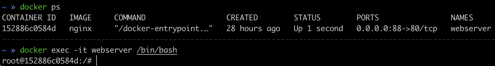
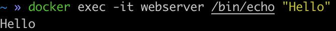
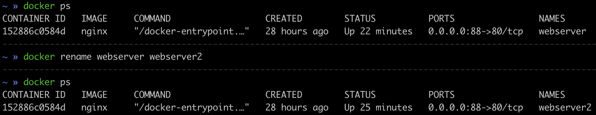
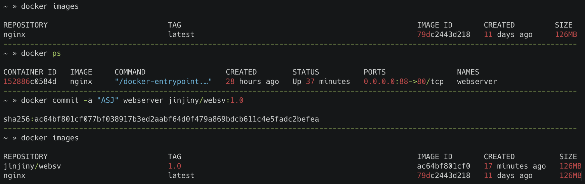

docker에 대하여 2
<br> → 가동 중인 Docker 컨테이너 조작
{: .notice--info}


### 가동되고있는 컨테이너 확인

```shell
docker stats
```


### 가동 컨테이너 연결

```docker
docker container attach {컨테이너명}
```

컨테이너에 들어간 상태에서 exit를 하게되면 '컨테이너 중단'이 일어나게 된다.(즉, STATUS가 Exited 상태)

컨테이너 중단 없이 백그라운드로 가동시켜놓으면서 연결에서 빠져나오는 방법은 Ctrl+P, Ctrl+Q를 순서대로.

즉, 컨테이너 attach 상태에서

컨테이너 종료 = exit

컨테이너 분리 = Ctrl+P, Ctrl+Q  (컨테이너는 백그라운드모드로 전환하고 빠져나오는것과 같은 효과)


### 가동 컨테이너에서 프로세스 실행

```docker
docker exec [옵션] <컨테이너식별자> <실행할 명령> [인수]
```

백그라운드에서 실행되고있는 컨테이너에 액세스 하고 싶을 때 **docker attach 명령으로 연결해도 쉘이 작동하지 않는 경우**는 명령을 접수할 수가 없다. 그래서 **위와 같은 명령을 통해 임의의 명령을 실행**할 수 있다.

예를들어 webserver라는 이름으로 가동 중인 컨테이너에서 `/bin/bas`h를 실행하려면 쉘을 시작하여 컨테이너 안에서 임의의 명령을 실행할 수 있다.

즉, attach는 컨테이너에 '접속' exec는 컨테이너에 '명령' ( 이전 페이지에서 설명했듯, `/bin/bash`를 여는 것은 컨테이너에게 '대화하자'고 명령(실행)하는 개념이기 때문에 attach가 아니라 exec)

`docker exec -it webserver /bin/bash`



또한 아래처럼 직접 실행할 수도 있음



※정지 중인 컨테이너는 docker start 명령을 사용하여 컨테이너 시작이 먼저 필요

> **attach, exec 차이**
>
> 잔재미코딩 :
>
> 보통 네트워크쪽은 사용법에 집중하시더라고요. 개발쪽에 익숙하신 분들은 기능에 집중을 하고요.
>
> 보통 개발쪽은 굉장히 많은 명령어가 있어요. 필요에 따라, 선호에 따라 만들어놓는 것이라서, 유사한 명령이 많습니다. 그래서 개발자들은 보통 그럴 경우, 둘다 되는구나 정도로 하고 그 중에 내가 선호하는 명령으로 쓰는데요. 이런 분야에 익숙하지 않으시면, 이 둘이 유사한데 왜 두 방법이 있는지를 궁금해하시더라고요. 그러다보면, 이게 나아가서, 뭔가 답변이 결국 이런 기능을 만들었던 개발자의 마음을 투영해서 설명을 드려야 하는 상황이 생길 때가 있고, 그러면, 뭔가 질문과 답변 둘다 애매한 상황이 생기더라고요.
>
> 정확하게는 exec 는 내부에 들어가지 않고 실행하는 도커에 명령을 실행시키는 것일꺼고요. attach 는 실행중인 도커에 들어가는 것이니까요. 명령하나만 실행시키고 싶을 때는 exec 로, 여러 명령도 쓰면서 도커 내부에서 무슨 작업을 하고 싶다면 attach 를 쓰는게 더 나을 수 있지만, 역시 선호의 문제라고 보셔도 좋을 것 같습니다.
>
> 다음 링크도 한번 참고해보셔도 좋을 것 같습니다. 감사합니다.


### 가동컨테이너의 포트 전송 확인

```shell
docker port {컨테이너명}
```


### 컨테이너 이름 변경

```shell
docker rename {기존이름} {바꿀이름}
```




### 컨테이너를 이미지로 작성하기

```shell
docker commit [옵션] <컨테이너식별자> [이미지명[:태그명]]
```



위의 -a 옵션은 이미지 상세정보에 "작성자"를 명세하는 옵션 → 실무에서는 '이메일'을 입력하면 되겠다.

그외 주요 옵션

- -m : 이미지 상세정보에 메세지 입력 (여기서 입력한 작성자와 메세지같은 정보는 docker image inspect 명령으로 이미지 상세정보를 볼 때 확인할 수 있다)
- -c : 커밋시 Dockerfile 명령을 지정
- -p : 커밋 전 컨테이너를 일시정지하고 커밋