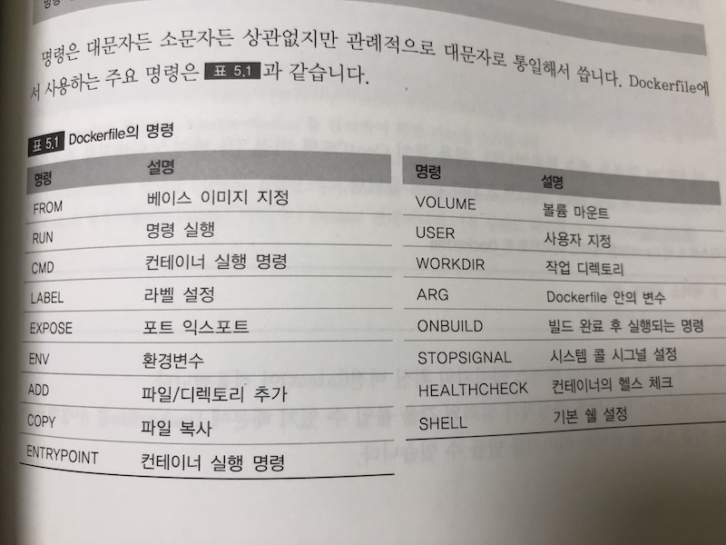
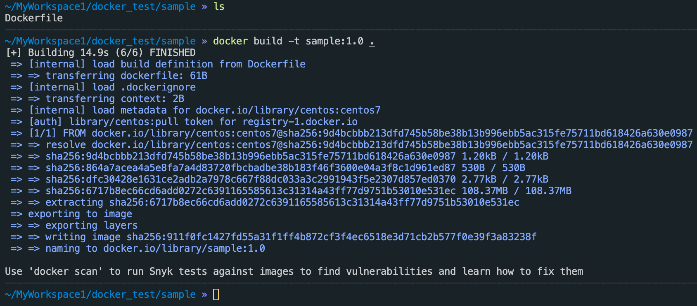

docker에 대하여 3
<br> → Dockerfile
{: .notice--info}


# Dockerfile

**Dockerfile 명령 종류**




### Dockerfile 작성 1

```shell
mkdir sample $$ cd $_ # sample이란 디렉토리 생성 후 해당 디렉토리로 이동
touch Dockerfile
ls # 결과로 Dockerfile 파일이 조회됨
```

### Dockerfile 작성2(Dockerfile 빌드)




```shell
docker build -t sample:1.0 .
```

→ 현재 위치에 있는 Dockerfile을 default로 찾고, 그 파일의 내용을 읽어 해당 이미지를 sample이란 이미지로 생성(build) 한다는 내용


### 임의의 이름으로 설정된 Dockerfile로 빌드

```shell
# 이름이 Dockerfile이 아니라 Dockerfile2.base 라고 가정
docker build -t sample -f Dockerfile2.base .
```

→  현재 위치에있는 Dockerfile2.base 파일의 내용을 읽어 sample 라는 이미지 이름으로 빌드  
단, 이렇게 Dockerfile이 임의의 이름일 때는 Docker Hub에서 이미지의 자동 생성 기능을 사용할 수 없다는 단점.


### Docker 이미지의 레이어 구조

예를들어,

```dockerfile
# STEP : 1 ubuntu (베이스 이미지)
FROM ubuntu:latest

# STEP : 2 Nginx 설치
RUN apt-get update && apt-get install -y -q nginx

# STEP : 3 파일 설치
COPY index.html /usr/share/nginx/html

#STEP : 4 Nginx 시작
CMD ["nginx", "-g", "daemon off;"]
```

이렇게 되면 단계별로 이미지가 4번 작성된다.

A → A+B → A+B+C → A+B+C+D

여기서 베이스 이미지를 바탕으로 여러개의 이미지가 작성되면서 베이스 이미지의 레이어가 공유된다. 이에 따라 디스크 용량을 효율적으로 이용한다.