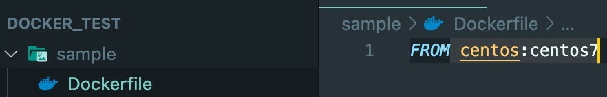

docker에 대하여 3
<br> → Dockerfile
{: .notice--info}


# Dockerfile

**Dockerfile 명령 종류**


### Dockerfile 작성 1

```shell
mkdir sample $$ cd $_ # sample이란 디렉토리 생성 후 해당 디렉토리로 이동
touch Dockerfile
ls # 결과로 Dockerfile 파일이 조회됨
```

### Dockerfile 작성2(Dockerfile 빌드)




```shell
docker build -t sample:1.0 .
```

→ 현재 위치에 있는 Dockerfile을 default로 찾고, 그 파일의 내용을 읽어 해당 이미지를 sample이란 이미지로 생성(build) 한다는 내용


### 임의의 이름으로 설정된 Dockerfile로 빌드

```shell
# 이름이 Dockerfile이 아니라 Dockerfile2.base 라고 가정
docker build -t sample -f Dockerfile2.base .
```

→  현재 위치에있는 Dockerfile2.base 파일의 내용을 읽어 sample 라는 이미지 이름으로 빌드  
단, 이렇게 Dockerfile이 임의의 이름일 때는 Docker Hub에서 이미지의 자동 생성 기능을 사용할 수 없다는 단점.


### Docker 이미지의 레이어 구조

예를들어,

```dockerfile
# STEP : 1 ubuntu (베이스 이미지)
FROM ubuntu:latest

# STEP : 2 Nginx 설치
RUN apt-get update && apt-get install -y -q nginx

# STEP : 3 파일 설치
COPY index.html /usr/share/nginx/html

#STEP : 4 Nginx 시작
CMD ["nginx", "-g", "daemon off;"]
```

이렇게 되면 단계별로 이미지가 4번 작성된다.

A → A+B → A+B+C → A+B+C+D

여기서 베이스 이미지를 바탕으로 여러개의 이미지가 작성되면서 베이스 이미지의 레이어가 공유된다. 이에 따라 디스크 용량을 효율적으로 이용한다.


### RUN 명령

**Dockerfile**

```shell
FROM ubuntu:latest

RUN echo hi this is shell mode   #1
RUN ["echo", " 안녕하세요 Exec형식 입니다"]   #2
RUN ["/bin/bash","-c", "echo '안녕하세요 Exec형식에서 bash를 사용해 보았습니다'"]   #3
```

- Docker '**이미지를 생성할 때**' 실행됨

- 두 가지 기술 방법이 있음

  - Shell형식 (위에서 #1번 방식)

    - 기본적으로 /bin/sh -c 를 사용하여(경유하여) 명령을 실행했을 때와 동일하게 작동

    - 예를들어 `RUN apt-get install -y nginx` #Nginx설치

    - 기본 쉘을 변경하고 싶을 때는 SHELL명령을 사용

      - Linux의 기본 쉘은 ["/bin/sh", "-c"]

      - Windows는 ["cmd", "/S", "/C"]

      - SHELL을 통해 기본 쉘을 /bin/bash로 변경하여 RUN 을 실행하는 방법은

        ```docker
        SHELL ["/bin/bash", "-c"]
        
        RUN echo hello
        ```

        그럼 이 후 부터 Dockerfile 안에서 Shell 형식으로 지정한 RUN명령이나 CMD명령, ENTRYPOINT 명령에서 유효해짐

  - Exec형식

    - 쉘을 경유하지 않고 직접 실행됨. 따라서 명령 인수에 $HOME과 같은 환경변수를 지정할 수 없음
    - 실행하고 싶은 명령을 JSON배열로 지정하게됨
    - 다른 쉘을 이용하고 싶을 때는 RUN명령에 쉘의ㅣ 경로를 지정한 후 실행하고 싶은 명령을 지정 예를 들어 **/bin/bash** 에서 **apt** 명령을 사용하여 **nginx**를 설치하고자 할때 `RUN ["/bin/bash", "-c", "apt-get install -y nginx"]`

위의 Dockerfile을 토대로 빌드

```shell
docker build -t run-sample .
```


명령어 실행하면 run-sample이라는 이름의 이미지가 생성된다.


### 이미지가 생성될 때 어떤 명령이 실행 되는지 히스토리 보기

```shell
docker history {이미지명}
```

