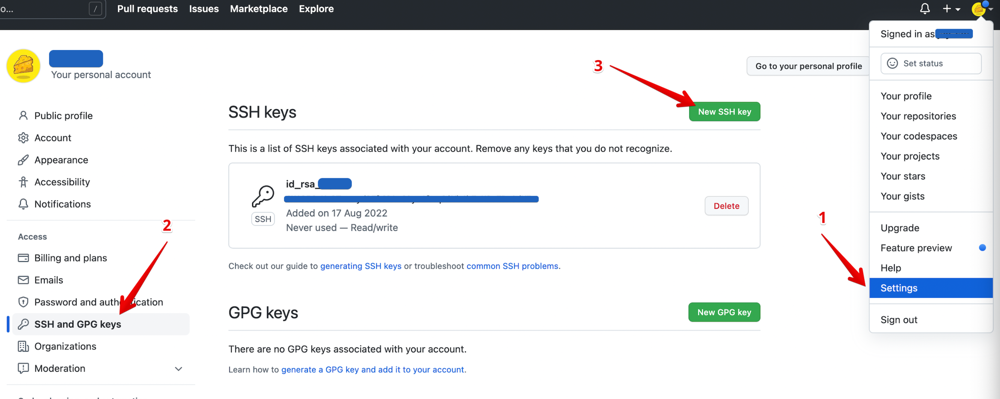

로컬에서 git 사용시 업무용과 개인용 계정을 분류하여 작업하고자 할 때 - 1
{: .notice--info}

**개요**

1. **<u>내 로컬에 여러 git 계정 등록</u> ←**

2. **[git 사용시 사용할 계정 자동 분류](http://localhost:4000/git/git-multiple-account-2/)**

이번 글에서는 첫번째, **내 로컬에 여러 git 계정 등록**하는 방법을 다룬다.

<br>

# 내 로컬에 여러 git 계정 '등록'하는 방법

---


## 1. ssh key 생성

```shell
cd ~/.ssh

ssh-keygen -t rsa -C "{git 계정 이메일}" -f "{키 이름}"
```

생성하고나면 `{키 이름}`, `{키 이름}.pub` 두가지가 생성된다.  
 `{키 이름}`는 프라이빗 키, `{키 이름}.pub` 는 퍼블릭 키

<br>

## 2. ssh agent 실행

```shell
eval "$(ssh-agent -s)"
```

<br>

## 3. ssh agent에 새로 생성한 프라이빗 key 추가

```shell
ssh-add ~/.ssh/{프라이빗키 이름}
```

<br>

## 4. ssh agent에 개인키 등록 되었는지 조회

```shell
ssh-add -l
```

<br>

## 5. SSH config 작성

```shell
vi ~/.ssh/config
```

열린 config 파일에 아래 내용 입력

```shell
# git계정(1)에 대한 SSH 설정
Host {아무이름} # ssh 연결 대표이름(간단하게 해도 됨)
    HostName github.com # github 도메인
    User {username} # git 계정에 설정된 username
    IdentityFile ~/.ssh/{개인키 이름} # 앞서 생성한 개인키 경로
```

<br>

## 6. git에 퍼블릭 키 등록

```shell
vi {키 이름}.pub
```

위 명령어를 통해 퍼블릭키 내용 확인 및 복사 후  git > Settings > SSH and GPG keys 에 붙여넣기(등록)



<br>

## 7. 마무리 - 연결 확인

```shell
ssh -T git@{ssh 연결 대표이름}
```

연결 확인 결과


"but GitHub does not provide shell access" 는 무시해도된다.

<br>

**위 과정을 등록하고자 하는 각 git 계정 수만큼 반복**