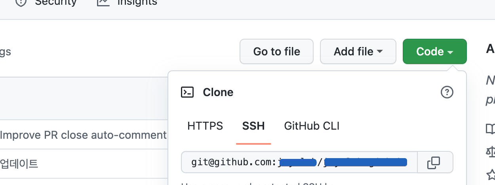

로컬에서 git 사용시 업무용과 개인용 계정을 분류하여 작업하고자 할 때 - 2
{: .notice--info}

**개요**

1. **[내 로컬에 여러 git 계정 등록](../git-multiple-account/)**

2. **<u>git 사용시 사용할 계정 자동 분류</u> ←**

이번 글에서는 두번째, **git 사용시 사용할 계정 자동 분류**하는 방법을 다룬다.

<br>

# 내 로컬에 git 사용시 사용할 계정 자동 분류

---


## 1. 전역적으로 설정된 git 계정 확인

작업 공간에 따라 활용할 git 계정을 분류하는 작업에 앞서, 현재 '전역적으로' 설정된 계정 확인.

```shell
vi ~/.gitconfig
```
실행 결과 (.gitconfig 파일 내용)
```
[user]
	name = {git사용계정의 유저명1}
	email = {git사용계정 이메일1}
```

위 처럼, .gitconfig파일에 설정된 계정은 **어느 디렉토리에서든** git 사용시 활용되는 계정정보. 

※ gitconfig 파일이 어느경로에 있는지 모를 때 : `git config --list --show-origin`

.gitconfig파일에 위와 같이 [user] 항목이 없다면 한번도 git login설정이 된 적 없다는 뜻

**※ git 계정정보 전역적 설정방법**

```shell
git config --global user.name {github 로그인유저명}
git config --global user.email {github 로그인이메일}
```


<br>

## 2. 회사 git 계정 추가

본인의 경우 .gitconfig 파일에서 확인한 계정(전역적으로 설정되어있는 계정)이 **'개인 git 계정'**이었기에, **'회사 git 계정'**을 추가하였다.

`~/.gitconfig` 파일 내용 

```
# 개인 git 계정
[user]
	name = {git사용계정의 유저명1}
	email = {git사용계정 이메일1}

# 회사작업공간
[includeIf "gitdir:{회사업무작업공간}"]
	path = .gitconfig-work
```

`~/.gitconfig-work` 파일 내용

```
# 회사 git 계정
[user]
	name = {git사용계정의 유저명2(회사작업 전용계정-유저명)}
	email = {git사용계정 이메일2(회사작업 전용계정-메일)}
```

이렇게하면 {회사업무작업공간} 경로 하위에서의 git 작업은 `.gitconfig-work` 파일에 명시해둔 계정을 사용하게된다.

<br>

## 3. 회사작업공간 내 기존 git 설정정보 초기화

주의사항으로, {회사업무작업공간} 하위에 이미  `.git` 파일이 존재하는 경우 기존의 **개인 git 계정**이 등록되어있고 해당 계정으로 remote 설정까지 되어있다는 의미이기 때문에, 새로운 gitconfig 정보를 적용해주어야 한다.  

```shell
# 기존의 remote 설정정보 삭제
git remote remove origin

# 기존의 git 계정정보 연결 해제 및 새로운계정 연동을 위한 git설정 초기화
git init

# 새로운 계정을 활용한 remote 설정
git remote add origin git@{~/.ssh/config 파일에 등록했던 회사전용 git계정의 host명}:{git 유저명}/{repository 명}.git


+ 혹은


# 기존의 git 계정정보 연결 해제 및 새로운계정 연동을 위한 git설정 초기화
git init

# 기존의 원격 연결정보 변경. 새로운 계정을 활용한 remote 설정
git remote set-url origin git@{~/.ssh/config 파일에 등록했던 회사전용 git계정의 host명}:{git 유저명}/{repository 명}.git

```

github 레파지토리 페이지에서 > [Code] > [SSH]를 보면, 레파지토리의 ssh형식 주소가 기본적으로 이와 같이 되어있다. `git@github.com:{유저명}/{repository 명}.git`  



여기서 도메인 부분 `github.com`을 [git 계정 다중 등록 - 1](https://jay-lab.github.io/git/git-multiple-account/) 편에서 { `~/.ssh/config`에 설정했던 **회사 git 계정에 대한 Host명**}으로 치환.

```shell
git@github.com:{git 유저명}/{repository 명}.git
↓
git@{회사 git계정 host명}:{git 유저명}/{repository 명}.git
```

치환된 ssh주소로 remote 연결을 하고나면 해당 작업공간에서는 완벽하게 회사 git계정정보를 가지고 동작하게된다.

<br>

**참고링크 :**

- <https://usingu.co.kr/frontend/git/한-컴퓨터에서-github-계정-여러개-사용하기/>
- <https://www.lainyzine.com/ko/article/useful-git-settings-when-using-github-multi-account/>
- <https://til.younho9.dev/log/2021/gitconfig-conditional-include/>
- <https://velog.io/@leyuri/Github-SSH-를-활용하여-git-계정-여러개-사용하기>
- <https://uzihoon.com/post/08d0e600-eaf4-11eb-8358-cfe0370fea45>
- <https://blog.outsider.ne.kr/1448>


