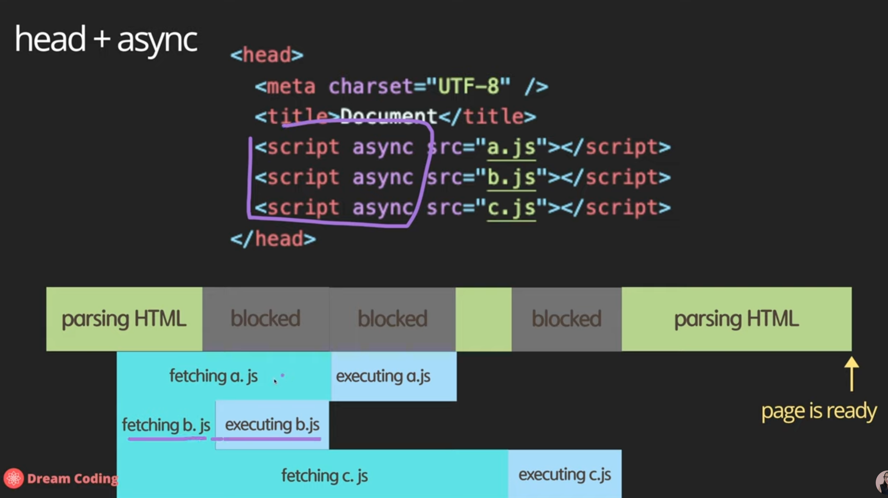

**Javascript 헷갈렸던 내용, 새로 알게된 내용 정리** (기본)

{: .notice--info}


### html 기본구조 쉽게 만들기 :

vs code에서 html확장자 파일 만든 후 !(느낌표)만 입력 후 스페어모양 클릭


### html 작성 후 바로 확인하기(프리뷰) :

CMD를 누른상태에서 L, O를 순서대로 누르면 크롬을 통해 프리뷰 가능


WebAPIs는 자바스크립트 언어 자체에 포함되어있는 것이 아니라 브라우저가 가지고 있는, 브라우저가 이해할 수 있는 함수들 ([참고링크](https://developer.mozilla.org/ko/docs/Web/API))


자바스크립트 공식사이트 : <www.developer.mozilla.org>


### async vs defer

1. head 태그 안에 script 태그를 배치하는 방식 → 브라우저가 위에서부터 순차적으로 읽다가('파싱'한다고 표현) script태그를 만나면 해당파일을 불러오는 과정이기 때문에 js 파일 사이즈가 클수록 html이 최종적으로 표시되는데까지 시간이 걸림
   parsing HTML > js파일? > fetching js > executiing js > parsing HTML

2. 그 다음 많이 하는 방식은 body태그 가장 마지막부분에 script태그를 추가하는 방식
   parsing HTML > 'page is ready' > fetching js > executing js
   화면은 즉각 볼수 있지만, HTML이 자바스크립트에 의존적이라면 정상적인 화면을 보는데까지는 또 시간이 걸림
3. **head + async 방식**
   `<script async src="main.js"></script>` (head 태그 안)
   parsing단계에서 script 태그를 만나면 파싱과 다운로드를 병렬적으로 진행. 계속해서 파싱중 js파일 다운로드가 완료되면 파싱을 멈추고 js 실행하는 방식
   파싱과 다운로드의 병렬처리 덕분에 다운로드받는 시간을 절약할 수 있으나, HTML 파싱 전 실행이 되면 HTML요소가 정의되어 있지 않은 시점에 실행되기 때문에 위험.
   
4. **head + defer 방식**
   `<script defer src="main.js"></script>` (head 태그 안)
   HTML 파싱과 js파일 다운로드 병렬 처리. HTML 파싱 중 js download가 완료되어도 실행은 파싱이 완료된 후 시작되는 방식 

### ECMAScript 5 부터 지원하는 'strict'모드 활성화

js파일 맨 윗줄에 `'use strict'` 라고 선언해놓으면 strict모드로써 좀더 상식적으로 코드를 작성할 수 있게된다. 타입스크립트를 사용할 때는 전혀 사용할 필요가 없지만, 순수 자바스크립트를 사용할 때는 사용하는 것이 권장됨. 기존의 자바스크립트는 매우 유연하지만 그만큼 위험하기 때문에 `'use strict'` 선언을 통해 타입에 대한 규제를 강화시켜 에러를 예방할 수 있다. + 자바스크립트 엔진이 더 효율적으로 빠르게 작업할 수 있어 성능 개선이라는 장점도 있다.


### ES6부터 추가된 let

Block scope : 변수를 {}괄호 안에 선언하는 것. 해당 중괄호 밖에서는 안에있는 변수를 사용할 수 없음

EC6 이전에는 var를 사용. 절대 권장되지 않는 선언 방식. 차이점이라고 한다면 선언을 소스 마지막 부에하고 변수 사용을 소스 초반부에 하더라도 에러 없이 변수사용이 가능하다는 점. 이것을 호이스팅(hoisting)이라고 한다. 즉, 변수 선언을 어디에 했든 상관없이 가장 상단으로 끌어올려주는 것.
또한 var는 block scope가 없음. block 밖에서도 해당 변수 사용이 가능.


### Constants

const를 사용한 변수 선언 방식 : 값을 선언하고 나면 변경 불가능. immutable data type이라고도 함.

대표적인 장점 3가지

- security : 해커들이 값을 변경해서 데이터를 조작하는 행위를 방지할 수 있음
- thread safety : 하나의 프로세스 안에서 여러개의 쓰레드가 하나의 값을 수정하기 위해 몰리는 것은 어떻게보면 위험한 방식인데 이것을 방지
- reduce human mistakes


### template literals (strings)

```javascript
const brendan = 'brendan';
const helloBob = `hi ${brendan}!`;
console.log('value: ${helloBob}');
// 결과 : value: hi brendan!
```


### increment operators

```javascript
let counter = 2;
const preIncrement = ++counter;

/** 이것은 아래와 같다. **/ //계산 먼저
counter = counter + 1;
preIncrement = counter;
따라서 counter도 3 preIncrement도 3

let counter = 2;
const postIncrement = counter++;

/** 이것은 아래와 같다. **/ //변수할당 먼저
postIncrement = counter;
counter = counter + 1;
따라서 counter는 4 postIncrement는 3
```


`x += y; //x = x + y;`


### equality

```javascript
0 == false // true
0 === false // false
'' == false // true
'' === false // false
null == undefined // true
null === undefined // false
```

