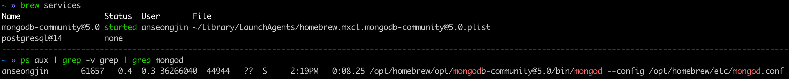

**MongoDB** 
<br> → 초기 세팅
{: .notice--info}


설치 환경 : MAC OS M1


확인했던 절차대로 했을 때 몇가지 문제가 존재

해결방법 >

- Appstore에서 Xcode 업데이트
- `arch -arm64 brew upgrade`

<br>

**본격 mongodb 설치 (brew 사용)**

```
arch -arm64 brew install mongodb-community@5.0
```

<br>

**MongoDB 실행**

```
brew services start mongodb-community@5.0
```

<br>

**MongoDB 실행 확인**

```
brew services` or `brew services list
```

or `ps aux | grep -v grep | grep mongod`



<br>

**로그파일 확인 (Apple Chip 기준)**

```
tail -f /opt/homebrew/var/log/mongodb/mongo.log
```

이후 **mongosh 입력하면 터미널에서 Mongo Shell 실행 됨**

<br>

본인의 경우, 도커를 통해 업무관련 mongodb 컨테이너가 실행되고 있었는데,
이 컨테이너와의 충돌을 피하기 위해 포트변경이 필요했다.

※ 포트변경이 필요한 경우, mongod.conf파일 수정 필요. homebrew를 통해 설치했기 때문에 일반적으로 구글링을 통해 볼수 있는 경로와 다른 곳에 위치해있음. 

 `/opt/homebrew/etc/mongod.conf`

net 부분에 port 추가

```yaml
systemLog:
  destination: file
  path: /opt/homebrew/var/log/mongodb/mongo.log
  logAppend: true
storage:
  dbPath: /opt/homebrew/var/mongodb
net:
  port: 27018 // ← 이 라인 추가.
  bindIp: 127.0.0.1
```

port를 바꾸고 나면 재시작 필요

```shell
brew services stop mongodb-community@5.0
brew services start mongodb-community@5.0

# 변경된 포트를 통해 mongosh을 접속하기 위해서는 포트 직접 명시 필요
mongosh --port 27018

# 접속 완료(이렇게하면 로컬에서 27017, 27018포트를 사용하는 데이터베이스 2개 사용가능)
```

