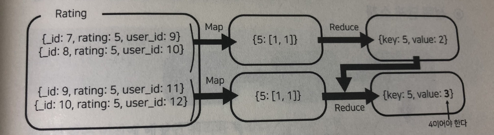

**MongoDB** 
<br> → 집계 처리. 그 중 **맵 리듀스**에 대하여
{: .notice--info}

<br>

# 집계

---

**집계처리 위치 특징**

|          | 애플리케이션      | 랩-리듀스         | 파이프라인   |
| -------- | ----------------- | ----------------- | ------------ |
| 자유도   | 좋다              | 좋다              | 나쁘다       |
| 처리속도 | 가장 나쁘다       | 보통              | 가장 좋다    |
| 램사용량 | 매우 높음         | 높음              | 낮음         |
| 처리위치 | 애플리케이션 내부 | 자바스크립트 엔진 | MongoDB 내부 |

## 맵 리듀스

핵심개념 : 도큐먼트를 묶고 난 후(**맵핑**), 묶인 데이터에 대해서 처리(**리듀싱**)하는 것

▼ 맵 리듀스 문법 구조

```javascript
db.colletcion.mapReduce(
  <map>,  // 어떤정보끼리 서로 묶일 수 있을지 정하는 함수를 명시
  <reduce>,  // 묶인 정보들끼리 연산하는 함수 명시
  {
    out: <collecton>, // 출력된 정보를 데이터베이스 내에 기록으로 남기도록 설정
    query: <document>, // (선택) map과정 실행 "전" 필요한 정보를 걸러내는 역할
    sort: <document>, // (선택) 어떤 값을 기준으로 정렬할지 설정
    limit: <number>, // (선택) 함수에 넣을 도큐먼트의 수 제한
    finalize: <function>, // (선택) reduce 과정 끝난 후 실행할 함수 명시
    scope: <document>, // (선택) map,reduce,finalize 함수에서 사용 가능한 전역변수설정
    jsMode: <boolean>, // (선택) map, reduce사이의 정보를 자바스크립트형태로 남길지 설정
    verbose: <boolean> // 연산처리에 걸린 시간을 보여줄지 설정. 기본값 false
  }
)
```

※ jsMode라는 설정을 사용하면 속도는 더 빨라지지만, 대량의 메모리가 필요하게 된다.


### 맵 리듀스 단계

1. **Map함수 실행** : 주어진 컬렉션에서 어떤 도큐먼트를 하나의 도큐먼트로 묶을지 정하는 과정  
   이는 자바스크립트 엔진 속에서 실행되기 때문에 BSON정보가 자바스크립트로 변환되는 과정이 필요하다.
2. **그룹핑** : 정해진 도큐먼트를 실제로 묶는 작업. 이는 jsMode값에 따라 처리 위치가 나뉘는데,  
   **false** → 자바스크립트 엔진에서 다시 MongoDB 내부로 정보를 보내서 그곳에서 처리 (기본값)   
   **true** → 자바스크립트 엔진 내에서 도큐먼트를 묶는 작업 수행
   이때문에 jsMode를 사용하게되면 정보교환이 적어져서 처리속도는 높아지지만 램 메모리를 더 많이 사용하게 된다는 부작용.
3. **Reduce함수 실행** : 그룹핑된 도큐먼트 내에서 정해진 연산 수행
   (개수를 센다든가, 평균을 구하는 것과 같은 작업 수행)
4. **Out 과정** : 어떻게 출력할지 정하는 과정. 이 과정에서 컬렉션에 저장할 수도 있고, 단순하게 저장없이 셸에 표현만 하게 할 수 있다.


## 연습

**유저가 앱에 별점을 주었는데, 1점부터 5점 까지 각각 몇 명이 별점을 주었는지 알아내는 과정**

가정 : 컬렉션 rating안에는 다음과 같은 데이터들이 들어있다.

```javascript
> db.raging.find()
{_id: 1, rating: 1, user_id: 2}
{_id: 2, rating: 2, user_id: 3}
{_id: 3, rating: 3, user_id: 4}
{_id: 4, rating: 3, user_id: 1}
{_id: 5, rating: 4, user_id: 5}
{_id: 6, rating: 4, user_id: 8}
{_id: 7, rating: 5, user_id: 9}
{_id: 8, rating: 5, user_id: 10}
{_id: 9, rating: 5, user_id: 11}
{_id: 10, rating: 5, user_id: 12}
```

<br>

**map 함수**

```javascript
var mapper = function(){
  emit(this.rating, this.user_id)
        ↑그룹핑 기준    ↑그룹핑 후 넘길 배열 값
}
```

- map, reduce, finalize 함수에서 입력받은 도큐먼트는 `this`로 표현.
- map함수 다음단계로 도큐먼트를 넘겨주기 위해서는 `emit`이라는 특별한 함수를 사용.  
  첫번째 파라미터는 <u>그룹핑의 기준</u>  
  두번째 파라미터는 <u>다음 단계에 넘겨줄 값</u>을 담는다

<br>

**reduce 함수**

```javascript
var reducer = function(key, values){
  return values.length
}
```

- 첫번째 파라미터 : 그룹핑된 기준 값
  두번째 파라미터 : 각각의 값이 담긴 배열 값
- 다음 단계로 값을 넘길때 return을 사용

<br>

reduce 이 후 <u>결과값을 컬렉션에 저장</u>하고자 할 때 **out** 값 형태는 아래 표 참고

| out 옵션                                                     | 설명                                                         |
| ------------------------------------------------------------ | ------------------------------------------------------------ |
| > db.collection.mapReduce(mapFunction, reduceFunction, {out: {inline:1}}); | 맵리듀스 결과를 화면 혹은 클라이언트 명령의 결과로 전달한다. |
| > db.collection.mapReduce(mapFunction, reduceFunction,  {out: "**collection**"}); | 맵리듀스의 결과를 collection이라는 이름의 컬렉션으로 저장한다. |
| > db.collection.mapReduce(mapFunction, reduceFunction,  {out: **{replace:"collection"}**}); | collection이라는 컬렉션이 이미 존재한다면 기존 내용을 모두 삭제하고, 맵리듀스 명령의 결과를 해당 컬렉션에 저장한다. |
| > db.collection.mapReduce(mapFunction, reduceFunction,  {out: **{merge:"collection"}**}); | collection이라는 컬렉션이 이미 존재하고, 프라이머리 키가 동일한 문서가 존재한다면 맵리듀스의 결과로 그 문서를 덮어쓰기 한다. |
| > db.collection.mapReduce(mapFunction, reduceFunction,  {out: **{reduce:"collection"}**}); | collection이라는 컬렉션이 이미 존재하고, 프라이머리 키가 동일한 문서가 존재한다면 맵리듀스의 결과와 기존 문서를 이용해서 다시 맵리듀스를 실행해서 결과를 저장한다. 즉, reduce 타입의 out은 incremental 맵리듀스를 실행할 때 사용한다. |
| > db.collection.mapReduce(mapFunction, reduceFunction,  {out: **{replace:"collection", db: database}**}); | 맵리듀스의 결과를 새로운 database라는 데이터베이스의 collection 컬렉션에 저장한다. |
| > db.collection.mapReduce(mapFunction, reduceFunction,  {out: **{replace:"collection", sharded:true}**}); | 맵리듀스의 결과를 collection 컬렉션에 저장하고, 이때 collection 컬렉션을 _id 필드를 기준으로 샤딩한 다음 결과를 저장한다. 4.2 버전 기준으로 해당 옵션은 deprecated 됬다. 현재는 샤딩된 컬렉션으로 출력하기 위해서는 미리 먼저 샤딩된 컬렉션을 생성해야한다. |
| > db.collection.mapReduce(mapFunction, reduceFunction,  {out: **{merge:"collection", nonAtomic:true}**}); | 맵리듀스의 결과를 collection 컬렉션에 저장할 때 원자 단위로 처리한다. action값이 merge나 reduce일 때만 사용되며, 기본값인 false의 경우 맵리듀스 결과로 저장할 때 해당 데이터베이스는 잠금상태. true면 잠기지 않음. |

(※ 표 출처 : <https://coding-start.tistory.com/293>)

여기서는 단지 출력만 할 것이기 때문에 다음과 같이 명령어를 작성한다.

```javascript
db.rating.mapRedduce(mapper, reducer, {out: {inline: 1}})
```


**▼ 그 결과**

```javascript
{
  "results" : [
    {
      "_id" : 1,
      "value" : 2
    },
    {
      "_id" : 2,
      "value" : 3
    },
    {
      "_id" : 3,
      "value" : 2
    },
    {
      "_id" : 4,
      "value" : 2
    },
    {
      "_id" : 5,
      "value" : 4
    }
  ],
  "timeMillis" : 26,
  "counts" : {
    "input" : 10,
    "emit" : 10,
    "reduce" : 3,
    "output" : 5
  },
  "ok" : 1
}
```

1점과 2점을 준사람은 각각 한 명 씩인데 결과가 잘못나온 것을 볼 수 있다.

그 이유는 rating컬렉션에서 map 함수 처리 이후 결과가 아래와 같이 나왔을때,

| map 처리 결과      |
| ------------------ |
| {1 : 2}            |
| {2 : 3}            |
| {3 : [4,1]}        |
| {4 : [5,8]}        |
| {5 : [9,10,11,12]} |

reduce 과정을 거치고 나면

| reduce 처리 결과    |
| ------------------- |
| {_id : 1, value: 2} |
| {_id : 2, value: 3} |
| {_id : 3, value: 2} |
| {_id : 4, value: 2} |
| {_id: 5, value: 4}  |

이와 같이, 리듀스 함수는 단일한 값을 가진 도큐먼트에는 실행되지 않고 <u>여러개의 도큐먼트가 묶인 도큐먼트에 대해서만</u> 실행되기 때문에 의도와 다른 값을 얻게 된 것.   
즉, 맵핑 함수만 통과한 도큐먼트(value 부분이 단일 정수값)와 두 함수 모두 통과한 도큐먼트(value 부분이 배열값)의 포맷이 서로 달라서 출력된 도큐먼트 결과도 제각각이 되어버린 것.  
map, reduce 함수 작성시 이러한 현상에 대하여 주의 필요하다.

이를 해결하기 위해 map함수를 다음과 같이 수정해야한다.

```javascript
// old
var mapper = function(){
  emit(this.rating, this.user_id)
}

↓

// new
var mapper = function(){
  emit(this.rating, 1)
}
```

이렇게 map함수만 수정할 경우, 의도한 결과가 나올수도 있지만 <u>나오지 않을 수도 있다</u>.  
예를들어 내부적으로 rating의 도큐먼트 10개를 **4개와 6개를 쪼개어 처리되는 경우** 문제가 있을 수 있다.

**case 1.**


**case 2.**



맵리듀스 과정은 처리할 데이터가 너무 많을 경우 앞선 도식과 같이 도큐먼트를 분할하여 처리하게 된다. 위 도식의 후반부를 보면 중간 결과물과 새로 맵핑한 도큐먼트들을 한 곳에서 넣어서 리듀스 함수에 집어 넣고있는 것을 확인할 수 있는데,

두번째 도식을 보면, 최종값 4가 나와야하지만 3이 나오는 이유는 아래와 같은 현상 때문.

``` javascript
reducer(5, [2,1,1]) => 3
reducer(5, [1,1,1,1]) => 4
```

이렇게 맵핑된 도큐먼트를 모두 한번에 넣고 나오는 결과가 다른 현상을 주의해야한다.

따라서, reduce함수도 다음과 같이 수정이 필요하다.

```javascript
var reducer = function(key, values){
  var counter = 0
  values.forEach(function(value){
    counter += value
  })
  return counter
}
```


최종적으로, 앱에 유저가 별점을 주었는데, 1점부터 5점 까지 각각 몇 명이 별점을 주었는지 알아낼 때의 map & reduce는 다음과 같다.

```javascript
var mapper = function(){
  emit(this.rating, 1)
}

var reducer = function(key, values){
  var counter = 0
  values.forEach(function(value){
    counter += value
  })
  return counter
}
```


좀 더 응용하여 'rating 컬렉션에서 _id값이 6 이하이면서 _id 값이 가장 큰 4개의 도큐먼트를 rating별로 분류한 다음, 각각의 도큐먼트 개수와 user_id 값들의 합, user_id의 평균을 구하는 방법'

```javascript
var mapper = function(){
	emit(this.rating, {count : 1, user_id_sum : this.user_id})
}

var reducer = function(key, values){
  var sum = 0
  var sounter = 0
  values.forEach(function(document){
    sum += document.user_id_sum
    counter += document.count
  })
  return {count: counter, user_id_sum : sum}
}

var finalizer = function(key, value){
  value,user_id_avg = value.user_id_sum/value.count
  return value
}

var options = {
  out : {inline : 1},
  query : {_id : {$lte : 6}},
  sort : {_id : 1},
  limit : 4,
  finalize : finalizer
}

db.rating.mapReduce(mapper, reducer, options)

// 결과
{
  "results" : [
    {
      "_id" : 3,
      "value" : {
        "count" : 2,
        "user_id_sum" : 5,
        "user_id_avg" : 2.5
      }
    },
    {
      "_id" : 4,
      "value" : {
        "count" : 2,
        "user_id_sum" : 13,
        "user_id_avg" : 6.5
    }
  ],
  "timeMillis" : 27,
  "counts" : {
      "input" : 4,
      "emit" : 4,
      "reduce" : 2,
      "output" : 2
  },
  "ok" : 1
}
```


여기까지 보면, 맵리듀스의 함수 파라미터는 다음과 같은 맥락을 가진다는 것을 이해할 수 있다.

- map함수 내 emit 함수의 **첫번째 파라미터** → 어느 필드를 기준으로 그룹핑 할 것인지

- map함수 내 emit 함수의 **두번째 파라미터** → 그룹핑 후, 각 그룹별 특정 필드 값을 모아서 <u>배열형태</u>로 reduce에 넘길 (배열)값 (그룹핑 했을 때 모은 값이 단일 값이 되어버리면 reduce함수가 적용되지 않고 pass된다는 점 주의)

1. **첫번째 연습**에서 두번째파라미터는 최종적으로 `1`이기 때문에, 그룹핑 된 도큐먼트의 갯수가 4개라고 가정하면  reduce로 넘길 두번째 파라미터는 `[1,1,1,1]`이 되고,  
2. **두번째 연습**에서 두번째 파라미터는 객체형태(`{count : 1, user_id_sum : this.user_id}`)이기 때문에 reduce로 넘길 값은 `[{count : 1, user_id_sum : 1}, {count : 1, user_id_sum : 2}, {count : 1, user_id_sum : 3}, {count : 1, user_id_sum : 4}]`

였다는 것을 이해하면 전체적으로 맵리듀스의 사용방법에 감이 잡힌다.

<br>

## 실습

**"2차 지방자치단체 올해 시도별 의회비 평균구하기. 가능하다면 구해진 의회비 평균으로 내림차순 정렬한 결과 출력."**

**단계별 전략**

1. 쿼리작업 : 세부항목이 의회비인 도큐먼트 불러오기
2. 맵핑 : 1차 지역명을 기준으로 그룹화한다
3. 리듀싱 : 예산의 합과 지방자치단체의 수 구하기
4. 마무리 : 예산 합에 자치단체 수를 나눈 평균을 구하기

```javascript
var mapper = function(){
  emit(this.city_or_province, {expense+sum: this.this_term_expense, count:1})
}

var reducer = function(key, values){
  var sum = 0
  var counter = 0
  values.forEach(function(document){
    sum += document.expense_sum
    counter += document.count
  })
  return {expense_sum: sum, count: counter}
}

var finalizer = function(key, value){
  value.expense_avg = value.expense_sum/value.count
  return value
}

var options = {
  out : "local_expense_sum",
  query : {sub_category:"의회비"},
  finalize : finalizer
}

db.local.mapReduce(mapper, reducer, options)


// mapReduce 실행결과
{
  "result" : "local_expense_sum",
  "timeMillis" : 93,
  "counts" : {
    "input" : 226,
    "emit" : 226,
    "reduce" : 16,
    "output" : 15
  },
  "ok" : 1
}
```

맵-리듀스 함수는 정렬한 결과를 바로 출력할 수 없기 때문에 먼저 결과를 저장해야 한다. 정보를 저장한 컬렉션에서 정렬되어서 출력되도록 명령을 주면 원하는 결과를 얻을 수 있다.

```javascript
db.local_expense_sum.find().sort({"value.expense_avg":-1}).pretty()
```

**▼ 최종결과**

```javascript
{
  "_id" : "충남",
  "value" : {
    "expense_sum" : 513674220,
    "count" : 15,
    "expense_avg" : 34244948
  }
}
{
  "_id" : "서울",
  "value" : {
    "expense_sum" : 105530,
    "count" : 25,
    "expense_avg" : 4221.2
  }
}
{
  "_id" : "강원",
  "value" : {
    "expense_sum" :  0,
    "count" : 18,
    "expense_avg" : 0
  }
}
(중략)
{
  "_id" : "전북",
  "value" : {
    "expense_sum" : 0,
    "count" : 14,
    "expense_avg" : 0
  }
}
{
  "_id" : "충북",
  "value" : {
    "expense_sum" : 0,
    "count" : 11,
    "expense_avg" : 0
  }
}
```


