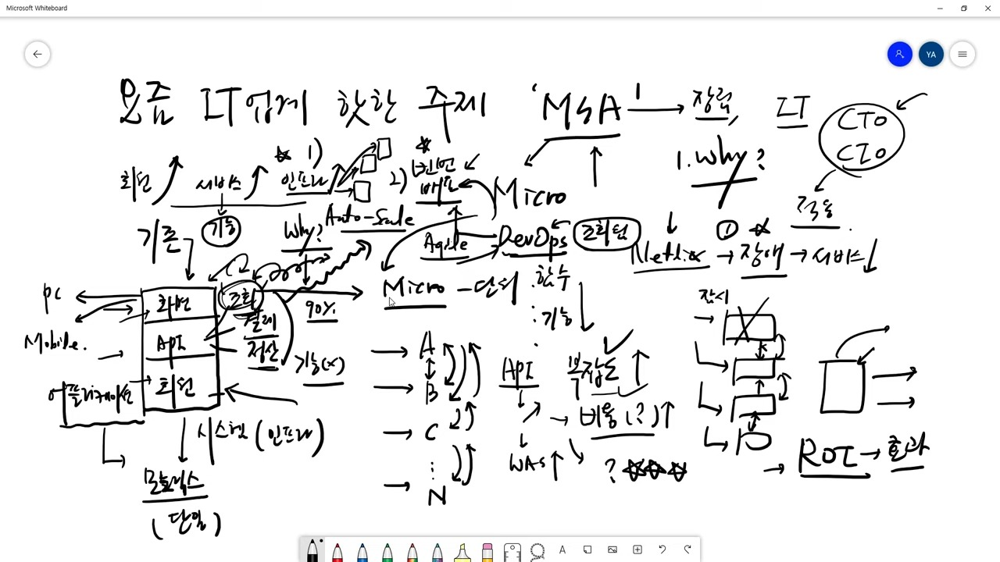

**Micro Service Architecture**에 대하여
  → 마이크로 서비스 아키텍쳐 장단점 및 도입시 고려사항
{: .notice--info}

 

# MSA (Micro Service Architecture)

## 사전적 개요

- 마이크로서비스 아키텍처(microservice architecture, MSA)의 서비스들은 HTTP와 같은 기술 불가지론적인 [프로토콜](https://ko.wikipedia.org/wiki/통신_프로토콜)을 사용하여 목표를 달성하기 위해 [네트워크](https://ko.wikipedia.org/wiki/컴퓨터_네트워크)를 통해 통신하는 [프로세스](https://ko.wikipedia.org/wiki/프로세스)들인 경우도 있다. 그러나, 서비스들은 [공유 메모리](https://ko.wikipedia.org/wiki/공유_메모리)와 같은 다른 종류의 [프로세스 간 통신](https://ko.wikipedia.org/wiki/프로세스_간_통신) 메커니즘을 사용할 수도 있다. 서비스들은 이를테면 [OSGI](https://ko.wikipedia.org/wiki/OSGi) 번들에서처럼 동일한 프로세스 내에서 실행할 수 있다.
- 마이크로서비스 아키텍처의 서비스들은 독립적인 전개(deploy)가 가능하다.
- 서비스의 교체가 쉽다.
- 서비스는 기능별로 분류된다. (예: [사용자 인터페이스](https://ko.wikipedia.org/wiki/사용자_인터페이스) 프론트엔드, 추천, 로지스틱스, 청구서 발부 등)
- 서비스는 최적의 조건에 부합하는 바에 따라 각기 다른 [프로그래밍 언어](https://ko.wikipedia.org/wiki/프로그래밍_언어), [데이터베이스](https://ko.wikipedia.org/wiki/데이터베이스), 하드웨어, 소프트웨어 환경을 사용하여 구현할 수 있다.
- 서비스들은 규모가 작고, 메시지 전달이 가능하며 컨텍스트별로 묶이며 자율적으로 개발되며 독립적으로 전개할 수 있으며 분산적이며 [빌드](https://ko.wikipedia.org/wiki/빌드_자동화)가 되며 [자동화된 프로세스들로 출시](https://ko.wikipedia.org/w/index.php?title=애플리케이션_릴리스_자동화&action=edit&redlink=1)된다.

마이크로서비스 기반 아키텍처는:

- [모듈성](https://ko.wikipedia.org/wiki/모듈성_(프로그래밍))이 있는 구조를 자연스럽게 강제한다.
- 자기 자신을 [지속적 배포](https://ko.wikipedia.org/wiki/지속적_배포) 소프트웨어 개발 프로세스에 위치시킨다. 애플리케이션의 사소한 부분의 변경은 하나 이상의 적은 수의 서비스의 다시 빌드, 재전개만을 필요로 한다.
- [섬세](https://ko.wikipedia.org/w/index.php?title=서비스_입자성_원칙&action=edit&redlink=1)(fine-grained)한 [인터페이스](https://ko.wikipedia.org/wiki/인터페이스_(컴퓨팅))(독립적으로 서비스를 전개할 수 있음), 비즈니스 주도의 개발(예: [도메인 드리븐 디자인](https://ko.wikipedia.org/w/index.php?title=도메인_드리븐_디자인&action=edit&redlink=1)), [클라우드 애플리케이션](https://ko.wikipedia.org/wiki/서비스형_소프트웨어) 아키텍처, [폴리곳 프로그래밍](https://ko.wikipedia.org/w/index.php?title=폴리곳&action=edit&redlink=1), 퍼시스턴스, 가벼운 [컨테이너](https://ko.wikipedia.org/wiki/운영_체제_수준_가상화) 전개, 탈중심화된 지속적 배포, 전체론적인 서비스 모니터링을 갖춘 [데브옵스](https://ko.wikipedia.org/wiki/데브옵스)와 같은 원칙들을 고수한다.
- 확장성에 이득이 되는 특징들을 제공한다.

[출처 : [위키백과](https://ko.wikipedia.org/wiki/%EB%A7%88%EC%9D%B4%ED%81%AC%EB%A1%9C%EC%84%9C%EB%B9%84%EC%8A%A4)]

## 참고 영상

사전적인 의미부터 확인해 보았으나 결론적으로 "**아직 산업적인 합의는 없으며 공식적인 정의도 없다**"고 되어있다. 그러면서도 앞서 기술한 내용과 같이 대략적인 개요로 정리되어있었고,  
사전적인 용어 확인 전 **기술노트with 알렉**님 채널의 MSA에 대한 영상부터 본 덕에 이해하기 훨씬 수월하였다.

<iframe width="560" height="315" src="https://www.youtube.com/embed/dSGnJWHuxtQ" title="YouTube video player" frameborder="0" allow="accelerometer; autoplay; clipboard-write; encrypted-media; gyroscope; picture-in-picture" allowfullscreen></iframe>

위 영상의 설명을 통해 이해한 MSA를 요약하자면 다음과 같다. 

> "하나의 어플리케이션 안에서 관리되던 각종 기능, 서비스, API들"을 **작은단위**로 분리하여 각 단위별로 개발, 확장, 배포, 운영 및 관리하는 방법론

## 장점

**장점**에 대한 간단한 예로

- 결제 서비스에 부하가 발생하면 결제만 증설할 수 있다. 기존의, 어플리케이션 전체 단위로 오토스케일링이 이루어지는 방식에 비해 서버 자원낭비를 줄일 수 있으며 이에 따라 비용차이도 발생한다.
- 특정 서비스에 대한 보수 및 배포가 빈번한 경우, 전체 서비스에 대한 영향도를 최소화 하여 관리할 수 있다.
- 특정 서비스가 다운되더라고 전체 서비스에 영향을 최소화 할 수도 있다.

## 단점

- 작은단위로 나누는 만큼 관리포인트가 증가한다.
- 증가하는 관리포인트 만큼 더 다양한 장애에 부딪힐 수 있다.

## 부연설명

- MSA : 바운더리를 정해서 팀 간 간섭을 최소화한 서비스 형태
- 영상에서는 이와같이 세분화 후의 특정 서비스를 대상으로 기능 개발부터 빌드 및 배포, 운영 및 관리 전체를 아우르는 것을 **DevOps** 라고 설명 (8:05)

## 마무리

이렇듯, MSA는 무조건 좋고 나쁘다 할 수 없다. 규모가 작은 조직, 규모가 크지 않은 애플리케이션이라 할지라도 특정 서비스에 대해서만 관리포인트가 몰려있다면 잘개 쪼개어 관리하는 것도 나쁘지 않을 수 있다는 생각과 함께 규모가 큰 조직 ・ 서비스일 수록 MSA 기법 활용을 더 긍정적으로 검토해 볼 것 같다.