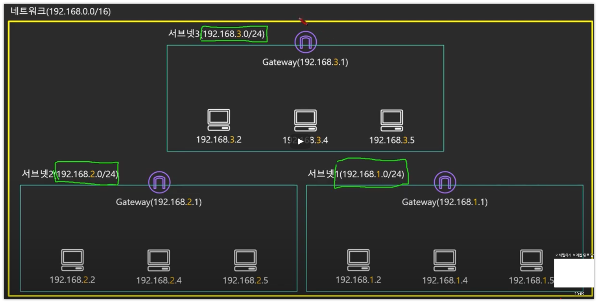

# TIL

## 20230118 : (AWS 강의실) 서버 없이 웹호스팅하기 : S3 Static Web Hosting

## 20230120 : (AWS 강의실) IP 주소를 묶는 방법, CIDR란?

1. 게이트웨이란?
2. 외부에서의 IP, 사설망에서의 IP 동일한 경우 차이점
3. 12:40 - CIDR Notation 서브넷이 몇개의 호스트를 가지고 있는지 계산하는 방법
4. CIDR Block 첫번째, 마지막 IP의 의미
   1. 첫번째 IP : 네트워크 자체를 가리킴
   2. 마지막 IP : Broadcast IP
5. AWS에서는 총 5개의 Address를 예약
   1. 0 : 네트워크 어드레스
   2. 1 : VPC Router
   3. 2 : DNS
   4. 3 : Future use
   5. 마지막 : Broadcast

CIDR 관련 유용한 사이트 : cidr.xyz

20230120 : RDS(1)

20230122 : RDS(1)

- RDS 생성시 ""프로덕션, 개발/테스트, 프리티어"의 차이 :  
  프로덕션의 경우 기본적으로 Multi-AZ, 나머지는 RDS 인스턴스 하나만 만들어 줌 

